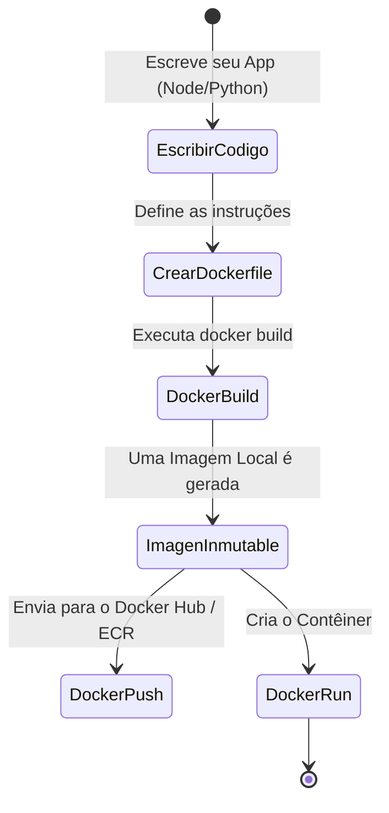

# Criando suas Próprias Imagens (Dockerfile)

Depois que você souber como executar contêineres criados por outras pessoas (como NGINX ou Postgres), é hora de empacotar seu próprio código. A verdadeira mágica do Docker reside na **imutabilidade**: se você empacotar seu aplicativo hoje, ele será executado exatamente da mesma forma no computador do seu colega de trabalho ou nos servidores da AWS daqui a 5 anos.

## 1. O Manifesto: O que é um Dockerfile?

Um `Dockerfile` é um arquivo de texto simples (sem extensão) que contém uma série de instruções lógicas que o Docker lê de cima para baixo para montar uma imagem.

### O Ciclo de Vida de Empacotamento



## 2. Construindo um App Web (Node.js)

Suponha que tenhamos uma API em Node.js muito simples. Nosso projeto tem a seguinte estrutura:

```text
/meu-projeto
├── package.json
├── package-lock.json
├── server.js
└── Dockerfile
```

### O Dockerfile Padrão

Crie o arquivo `Dockerfile` e adicione as seguintes camadas:

```dockerfile
# 1. Camada Base: Nunca use a tag 'latest' em produção. Use versões fixas.
FROM node:18-alpine

# 2. Diretório de Trabalho: Tudo o que se seguir será executado dentro desta pasta no contêiner
WORKDIR /usr/src/app

# 3. Cache de Dependências: Copiamos APENAS os arquivos de dependências primeiro.
# Isso é fundamental para aproveitar o cache de camadas do Docker.
COPY package*.json ./

# 4. Instalação: Executamos o gerenciador de pacotes. Só será repetido se os arquivos JSON mudarem.
RUN npm install --production

# 5. Código Fonte: Agora copiamos o resto da aplicação.
COPY . .

# 6. Variáveis e Portas: Declaramos a porta na qual o app escuta (apenas documentativo).
EXPOSE 3000
ENV NODE_ENV=production

# 7. Execução: O comando padrão quando o contêiner inicia.
CMD ["node", "server.js"]
```

## 3. O Poder do Cache de Camadas (Layer Caching)

Por que separamos o `COPY package*.json` do `COPY . .`? 
O Docker armazena em cache o resultado de cada linha. Se você mudar a cor de um botão no seu código (`server.js`), o Docker reutilizará o cache das dependências (`npm install`) porque o arquivo `package.json` não mudou. Se você tivesse copiado tudo junto (`COPY . .` seguido de `RUN npm install`), uma simples mudança de texto forçaria o Docker a reinstalar todas as dependências, tornando sua implantação extremamente lenta.

## 4. Construir e Executar

Com nosso `Dockerfile` pronto, dizemos ao Docker para construir a imagem (o ponto `.` indica para procurar o Dockerfile no diretório atual):

```bash
docker build -t minha-api-node:v1 .
```

Terminada a construção, iniciamos o contêiner:

```bash
docker run -d --name backend-api -p 3000:3000 minha-api-node:v1
```

## 5. O Escudo Protetor: .dockerignore

Se você executar o `docker build` em um projeto Node.js, corre o risco de copiar a imensa pasta `node_modules` de sua máquina local para o contêiner, substituindo a instalação nativa do contêiner (que pode usar uma arquitetura de CPU diferente).

Para evitar isso, SEMPRE crie um arquivo `.dockerignore`:

```text
node_modules
npm-debug.log
.git
.env
```

Com essas bases dominadas, você está pronto para parar de rodar contêineres isolados. No **Nível Médio**, aprenderemos a conectar vários serviços (como sua API em Node.js e um banco de dados PostgreSQL) em uma rede orquestrada usando **Docker Compose**.
