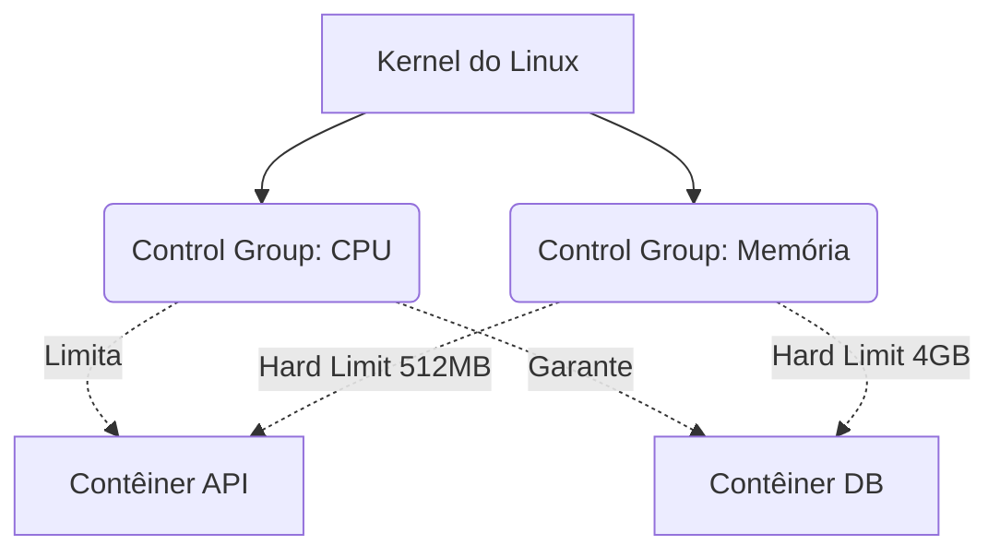

# Limites do Kernel, CGroups e Segurança

Você aprendeu a construir e orquestrar imagens hiper-otimizadas. Mas rodar contêineres em produção sem governar seus recursos é uma receita para o desastre sistêmico. Neste nível especialista, desceremos às entranhas do Kernel do Linux.

Como o Docker impede que um contêiner com um vazamento de memória (Memory Leak) consuma 100% da RAM do servidor físico e faça os outros aplicativos travarem? A resposta é **Cgroups (Control Groups)** e **Namespaces**.

## 1. Isolamento Físico vs Isolamento Lógico

- **Namespaces:** Mentem para o contêiner. Fazem-no acreditar que tem seu próprio disco rígido, seu próprio sistema de rede e sua própria árvore de processos (PID 1). É o isolamento *Lógico*.
- **Cgroups:** Colocam algemas no contêiner. Limitam fisicamente a quantidade de CPU, RAM e I/O que o contêiner pode solicitar ao hardware subjacente. É o isolamento *Físico*.

### Arquitetura de Controle de Recursos



## 2. Implementando Limites Rígidos (Hard Limits)

Se um contêiner ultrapassar seu limite de memória alocado, o kernel do Linux invoca o infame **OOM Killer (Out Of Memory Killer)** e assassina o processo do contêiner imediatamente para salvar o sistema operacional host.

Sempre aplique políticas restritivas no seu `docker-compose.yml` (especialmente usando a especificação *Deploy* da versão V3/Compose Spec):

```yaml
services:
  data-processor:
    image: python-worker:latest
    deploy:
      resources:
        limits:
          cpus: '0.50'     # Máximo de meio núcleo físico de CPU
          memory: 512M     # O OOM Killer agirá se chegar a 513MB
        reservations:
          cpus: '0.10'     # CPU mínima garantida pelo agendador (scheduler)
          memory: 128M     # Memória mínima reservada
```

Com essa configuração, um loop infinito `while(True)` mal programado no worker do Python afetará apenas 50% de um núcleo, mantendo o servidor principal 100% estável.

## 3. Segurança Especialista: Drop Capabilities e Non-Root

Por padrão, o processo principal dentro de um contêiner Docker é executado como o usuário **root**. Esse é um risco gigantesco. Se houver um escape do contêiner (Container Breakout), o invasor terá privilégios de superusuário no servidor host.

### Regra 1: Usuário Não Privilegiado
Modifique o final do seu Dockerfile para degradar os privilégios antes de executar a aplicação.

```dockerfile
# ... (configurações anteriores) ...

# Criar um usuário do sistema sem shell nem privilégios
RUN addgroup -S appgroup && adduser -S appuser -G appgroup

# Atribuir a propriedade dos arquivos a esse usuário
RUN chown -R appuser:appgroup /usr/src/app

# Mudar o contexto para o usuário seguro
USER appuser

# Só agora executamos o servidor
CMD ["node", "server.js"]
```

### Regra 2: Remoção de Capacidades do Kernel (Capabilities)
Mesmo como `root`, o Linux divide os privilégios de superusuário em blocos chamados "Capabilities". Um contêiner por padrão retém demasiados (como o `CAP_NET_RAW` que permite fazer Ping e Spoofing de rede).

Em produção, você deve remover (drop) todas as capacidades e devolver apenas as estritamente necessárias.

```yaml
services:
  web:
    image: nginx:alpine
    cap_drop:
      - ALL # Destrói todos os privilégios do kernel
    cap_add:
      - NET_BIND_SERVICE # Permite associar-se apenas a portas baixas (<1024)
    security_opt:
      - no-new-privileges:true # Impede a escalada de privilégios interna
```

## Resumo Especialista
Um arquiteto de contêineres especialista assume que o contêiner será invadido e injetado com código malicioso. Aplicando limites restritos de Cgroups, executando processos como `USER não privilegiado` e removendo as `Capabilities` do Kernel, você garante que o raio de explosão (Blast Radius) de um ataque seja nulo. No nível **Mestre**, escalaremos isso para a orquestração global.
