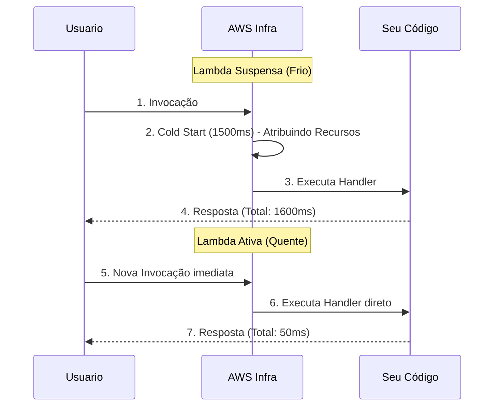

# Dominando o AWS Lambda e o Cold Start

O AWS Lambda é o núcleo absoluto da arquitetura Serverless. É um ambiente de computação efêmero. Literalmente, a AWS carrega seu código em um micro-contêiner, o executa, cobra os milissegundos usados e o destrói.

## 1. A Anatomia de uma Lambda

Uma função Lambda sempre consiste em três elementos essenciais em sua assinatura (signature).

```javascript
// index.mjs
export const handler = async (event, context) => {
  try {
    // 1. EVENTO: Contém os dados do acionador (S3, API Gateway, SQS)
    const body = JSON.parse(event.body);
    
    // 2. CONTEXTO: Metadados do ambiente (Tempo restante, Request ID)
    const tempoRestante = context.getRemainingTimeInMillis();

    if (body.action === 'procesar') {
       return { statusCode: 200, body: "Processado!" };
    }

  } catch (error) {
    console.error("Erro crítico:", error);
    return { statusCode: 500, body: "Erro interno" };
  }
};
```

### Restrições de Ferro (Limites Rígidos)
Você deve projetar sua arquitetura assumindo esses limites do Lambda:
* **Tempo Máximo de Execução:** 15 Minutos. (Se precisar de horas, use AWS Batch ou Fargate).
* **Memória Máxima:** 10 GB.
* **Camada Efêmera (`/tmp`):** Máximo de 10 GB de armazenamento temporário que desaparecerá.

## 2. O Inimigo #1: Cold Start (Início a Frio)

Se a sua Lambda não foi invocada nos últimos minutos, a AWS a suspende para economizar recursos. Quando chega uma nova requisição, a AWS deve:
1. Buscar um servidor físico com espaço.
2. Baixar o seu código de um bucket interno.
3. Iniciar o ambiente (Node.js, Python).
4. Executar a função.

Esse processo é chamado de **Cold Start**. Pode demorar de 300 milissegundos a 3 segundos, o que é terrível para a experiência do usuário.



### Estratégias Básicas de Mitigação
* **Minimizar o Peso do Pacote:** Não faça upload de uma pasta `node_modules` de 200MB. Use `esbuild` ou `webpack` para empacotar seu código em um único arquivo minificado de 2MB.
* **Inicialização Global:** As conexões de Banco de Dados devem ser feitas FORA do `handler`.

```javascript
import { Client } from 'pg';

// ✅ BOM: É executado durante o Cold Start e reutilizado em invocações quentes.
const db = new Client({ connectionString: process.env.DB_URL });
await db.connect();

export const handler = async (event) => {
  // Isso será super rápido.
  const res = await db.query('SELECT * FROM users');
  return { statusCode: 200, body: JSON.stringify(res.rows) };
};
```

No **Nível Médio**, veremos como conectar nossas Lambdas ao mundo exterior usando API Gateway e como gerenciar Bancos de Dados Serverless com DynamoDB.
