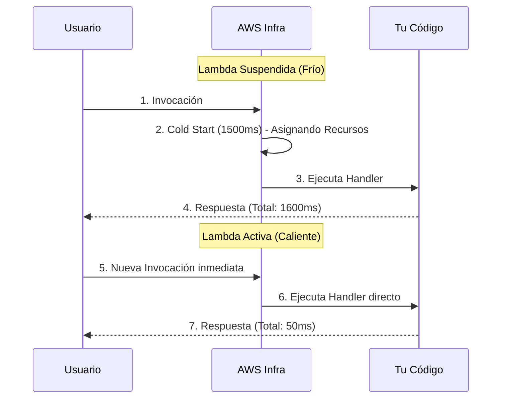

# Dominando AWS Lambda y el Cold Start

AWS Lambda es el núcleo absoluto de la arquitectura Serverless. Es un entorno de cómputo efímero. Literalmente, AWS carga tu código en un micro-contenedor, lo ejecuta, te cobra por los milisegundos usados, y lo destruye.

## 1. La Anatomía de una Lambda

Una función Lambda siempre consta de tres elementos esenciales en su firma (signature).

```javascript
// index.mjs
export const handler = async (event, context) => {
  try {
    // 1. EVENTO: Contiene la data del disparador (S3, API Gateway, SQS)
    const body = JSON.parse(event.body);
    
    // 2. CONTEXTO: Metadatos del entorno (Tiempo restante, Request ID)
    const tiempoRestante = context.getRemainingTimeInMillis();

    if (body.action === 'procesar') {
       return { statusCode: 200, body: "Procesado!" };
    }

  } catch (error) {
    console.error("Error crítico:", error);
    return { statusCode: 500, body: "Error interno" };
  }
};
```

### Restricciones de Hierro (Límites Duros)
Debes diseñar tu arquitectura asumiendo estos límites de Lambda:
* **Tiempo Máximo de Ejecución:** 15 Minutos. (Si necesitas horas, usa AWS Batch o Fargate).
* **Memoria Máxima:** 10 GB.
* **Capa Efímera (`/tmp`):** Máximo 10 GB de almacenamiento temporal que desaparecerá.

## 2. El Enemigo #1: Cold Start (Arranque en Frío)

Si tu Lambda no ha sido invocada en los últimos minutos, AWS la suspende para ahorrar recursos. Cuando llega una nueva petición, AWS debe:
1. Buscar un servidor físico con espacio.
2. Descargar tu código desde un bucket interno.
3. Iniciar el entorno (Node.js, Python).
4. Ejecutar la función.

A este proceso se le llama **Cold Start**. Puede demorar desde 300 milisegundos hasta 3 segundos, lo cual es terrible para la experiencia del usuario.



### Estrategias de Mitigación Básicas
* **Minimizar el Peso del Paquete:** No subas una carpeta `node_modules` de 200MB. Usa `esbuild` o `webpack` para empaquetar tu código en un solo archivo minificado de 2MB.
* **Inicialización Global:** Las conexiones a Base de Datos deben hacerse FUERA del `handler`.

```javascript
import { Client } from 'pg';

// ✅ BIEN: Se ejecuta durante el Cold Start y se reutiliza en invocaciones calientes.
const db = new Client({ connectionString: process.env.DB_URL });
await db.connect();

export const handler = async (event) => {
  // Esto será súper rápido.
  const res = await db.query('SELECT * FROM users');
  return { statusCode: 200, body: JSON.stringify(res.rows) };
};
```

En el **Nível Intermediário**, veremos cómo conectar nuestras Lambdas al mundo exterior usando API Gateway y cómo manejar Bases de Datos Serverless con DynamoDB.
