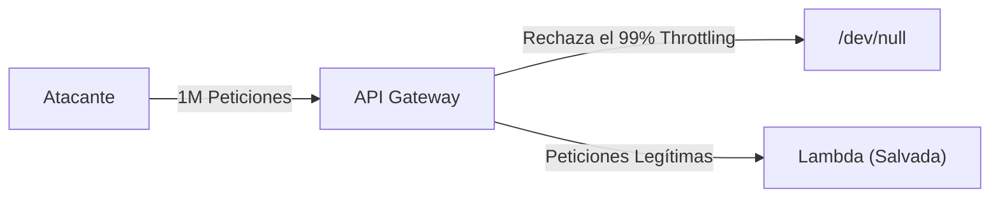

# API Gateway y DynamoDB (El Stack Serverless)

Tener código ejecutándose en Lambda es inútil si el mundo no puede acceder a él o si no puedes guardar datos de forma permanente. Aquí completamos la trinidad Serverless.

## 1. Amazon API Gateway

API Gateway actúa como la puerta principal de tu casa. Expone endpoints HTTP (`https://api.tu-dominio.com/usuarios`) y los enlaza a tus funciones Lambda.

### Beneficios Críticos
* **Protección Anti-DDoS nativa:** Integrado con AWS Shield.
* **Throttling (Limitación):** Puedes configurarlo para rechazar peticiones si superan 10,000 req/seg para proteger tu backend y tu presupuesto.
* **Autenticación en la Puerta:** Puede validar tokens JWT (usando Amazon Cognito o un Autorizador Lambda personalizado) *antes* de siquiera despertar a tu Lambda principal, ahorrando dinero.



## 2. Amazon DynamoDB: Base de Datos Serverless

Si conectas 10,000 Lambdas simultáneas a un PostgreSQL tradicional, derribarás la base de datos por exceder el límite de conexiones concurrentes (OOM - Out of Memory). Las bases de datos relacionales no nacieron para el Serverless.

**DynamoDB** es la base de datos NoSQL propietaria de AWS. No importa si le haces 10 peticiones por segundo o 10 Millones de peticiones por segundo; su latencia se mantendrá en un solo dígito (~5 milisegundos).

### Conceptos Clave de DynamoDB
No hay Tablas con "Relaciones" (JOINs). Todo se diseña en torno a dos llaves:
1. **Partition Key (PK):** Decide en qué servidor físico de AWS se guardará el dato.
2. **Sort Key (SK):** Ordena los datos dentro de esa partición física.

```json
// Ejemplo de un Elemento (Item) en DynamoDB
{
  "PK": "USER#123",            // (Partition Key)
  "SK": "METADATA#123",        // (Sort Key)
  "nombre": "Alice",
  "email": "alice@nmerge.ai",
  "suscripcion": "PREMIUM"
}
```

### Operaciones Básicas desde Node.js (AWS SDK v3)

```javascript
import { DynamoDBClient } from "@aws-sdk/client-dynamodb";
import { PutCommand, DynamoDBDocumentClient } from "@aws-sdk/lib-dynamodb";

const client = new DynamoDBClient({});
const docClient = DynamoDBDocumentClient.from(client);

export const handler = async (event) => {
  const body = JSON.parse(event.body);

  const command = new PutCommand({
    TableName: process.env.TABLE_NAME,
    Item: {
      PK: `USER#${body.id}`,
      SK: `METADATA#${body.id}`,
      nombre: body.nombre
    },
  });

  await docClient.send(command);
  
  return { statusCode: 201, body: "Usuario guardado en DynamoDB" };
};
```

## Próximos Pasos
Crear estos recursos haciendo clics en la consola web de AWS (Click-Ops) es un pecado capital en la industria. En el **Nível Avançado**, abrazaremos la Infraestructura como Código (IaC) usando Serverless Framework, SAM o Terraform.
