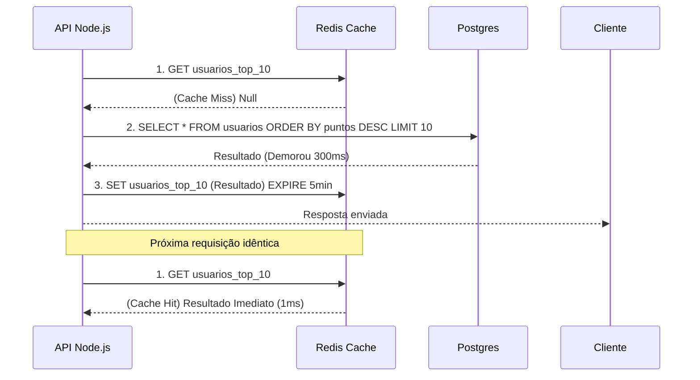

# Microsserviços, Redis Cache e Mensagens (Event-Driven)

Quando uma API REST em Node.js escala para suportar um milhão de usuários, o gargalo não é mais o Event Loop, é o Banco de Dados. Cada consulta SQL adiciona de 50ms a 200ms. Se 10.000 usuários consultarem a Home do seu aplicativo ao mesmo tempo, seu banco de dados morrerá.

## 1. O Cache Distribuído (Redis)

Redis é um banco de dados In-Memory (vive na RAM) chave-valor. Sua latência de leitura é menor que 1ms. 

O padrão mestre é o **Cache-Aside Pattern**:



## 2. Event-Driven Architecture (Microsserviços)

Em um Monolito, se ocorrer uma venda, você chama as funções sequencialmente: `crearOrden()`, `restarStock()`, `enviarEmail()`. Se enviar o e-mail demorar 3 segundos, o usuário fica esperando.

Em Microsserviços, usamos **Message Brokers** (RabbitMQ, Kafka, AWS SQS) para desacoplar as operações.

```javascript
// Serviço de Pagamentos (Node.js)
const channel = await RabbitMQ.createChannel();

app.post('/pagar', async (req, res) => {
  const exito = await procesarTarjeta(req.body);
  
  if (exito) {
    // Fogo e Esquecimento (Fire and Forget)
    // Disparamos um evento na fila e respondemos ao usuário INSTANTANEAMENTE.
    channel.publish('ventas_exchange', 'pago.completado', Buffer.from(JSON.stringify(req.body)));
    
    return res.json({ msg: "Sua ordem está sendo processada." });
  }
});
```

Enquanto isso, em contêineres totalmente separados (talvez escritos em Python ou Go), outros microsserviços estão *ouvindo* esse evento:
* O **Serviço de E-mails** escuta `pago.completado` e envia o recibo.
* O **Serviço de Estoque** escuta `pago.completado` e subtrai o estoque.

## 3. JWT e Sessões Stateless

As arquiteturas distribuídas exigem autenticação sem estado (Stateless). Em vez de salvar as sessões na memória do servidor (o que quebraria se você tivesse 5 instâncias do Node atrás de um Load Balancer), usamos **JSON Web Tokens (JWT)**.

O JWT contém as informações de autorização criptografadas *dentro* da própria string. O servidor não precisa verificar o banco de dados para saber se você é um Admin; ele simplesmente descriptografa criptograficamente o JWT com sua assinatura secreta (`HMAC SHA256`).

No **Nível de Otimizações**, usaremos Node Clusters, PM2 e analisaremos threads de trabalho (Worker Threads) para extrair o máximo do hardware bare-metal.
