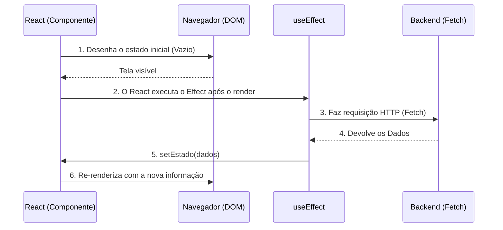

# Hooks Core e Gestão de Estado Local

Os componentes funcionais por si só são puros e sem memória ("Stateless"). Se você chamar uma função duas vezes, ela começa do zero. Para que um componente "lembre" de informações entre as renderizações (como um carrinho de compras ou se um modal está aberto), o React introduziu os **Hooks**.

## 1. O Estado Local: useState

O `useState` é o gancho mais crítico. Ele dá ao seu componente um cofre de memória particular que sobrevive aos ciclos de renderização.

```jsx
import React, { useState } from 'react';

export const Contador = () => {
  // 1. Declaração: 'contador' é o valor, 'setContador' é a função mutadora
  // 2. Inicialização: Começa em 0
  const [contador, setContador] = useState(0);

  return (
    <div>
      <p>Você clicou {contador} vezes</p>
      {/* Nunca sofrer mutação direta (ex: contador = contador + 1). Sempre usar o Setter */}
      <button onClick={() => setContador(contador + 1)}>
        Incrementar
      </button>
    </div>
  );
};
```

### Regra de Ouro do Estado: Imutabilidade
O React decide re-renderizar a tela comparando se o novo estado é diferente do anterior usando igualdade referencial (`===`). Se você tem um Array ou um Objeto, NUNCA deve fazer um `.push()` neles ou alterar suas propriedades diretamente, porque sua referência na memória não mudará e o React não atualizará a tela.
**Você sempre deve criar um novo Array ou Objeto copiando o anterior (Spread Operator `...`).**

## 2. Efeitos Colaterais: useEffect

Funções puras não devem tocar no "mundo exterior" (fazer requisições HTTP, inscrever-se em WebSockets, tocar no LocalStorage). Se você precisa fazer isso, deve usar o `useEffect`.



### O Array de Dependências

O segundo argumento do `useEffect` controla **quando** o efeito é executado. É a origem de 90% dos bugs no React se não for dominado.

```jsx
// Cenário 1: Sem array de dependências (Perigo)
// É executado APÓS CADA RENDER. Pode causar loops infinitos.
useEffect(() => { fetchDados() }); 

// Cenário 2: Array vazio [] (O "componentDidMount" moderno)
// É executado APENAS UMA VEZ quando o componente nasce.
useEffect(() => { fetchDados() }, []); 

// Cenário 3: Array com variáveis [userId]
// É executado ao nascer e CADA VEZ que 'userId' mudar.
useEffect(() => { fetchDadosUsuario(userId) }, [userId]); 
```

Dominar `useState` e `useEffect` permite construir 80% de qualquer aplicativo. No **Nível Médio**, resolveremos o infame problema do "Prop Drilling" e conectaremos nosso app a um estado global com a Context API.
