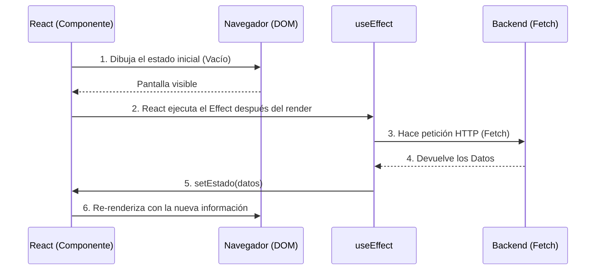

# Hooks Core y Gestión de Estado Local

Los componentes funcionales por sí solos son puros y sin memoria ("Stateless"). Si llamas a una función dos veces, empieza desde cero. Para que un componente "recuerde" información entre renderizados (como un carrito de compras o si un modal está abierto), React introdujo los **Hooks**.

## 1. El Estado Local: useState

`useState` es el gancho más crítico. Le da a tu componente una bóveda de memoria privada que sobrevive a los ciclos de renderizado.

```jsx
import React, { useState } from 'react';

export const Contador = () => {
  // 1. Declaración: 'contador' es el valor, 'setContador' es la función mutadora
  // 2. Inicialización: Arranca en 0
  const [contador, setContador] = useState(0);

  return (
    <div>
      <p>Has hecho clic {contador} veces</p>
      {/* Nunca mutar directamente (ej: contador = contador + 1). Siempre usar el Setter */}
      <button onClick={() => setContador(contador + 1)}>
        Incrementar
      </button>
    </div>
  );
};
```

### Regla de Oro del Estado: Inmutabilidad
React decide re-renderizar la pantalla comparando si el nuevo estado es diferente al anterior usando igualdad referencial (`===`). Si tienes un Array o un Objeto, NUNCA debes hacerles `.push()` o alterar sus propiedades directamente, porque su referencia en memoria no cambiará y React no actualizará la pantalla.
**Siempre debes crear un nuevo Array u Objeto copiando el anterior (Spread Operator `...`).**

## 2. Efectos Secundarios: useEffect

Las funciones puras no deben tocar el "mundo exterior" (hacer peticiones HTTP, suscribirse a WebSockets, tocar el LocalStorage). Si necesitas hacerlo, debes usar `useEffect`.



### La Matriz de Dependencias

El segundo argumento de `useEffect` controla **cuándo** se ejecuta el efecto. Es el origen del 90% de los bugs en React si no se domina.

```jsx
// Escenario 1: Sin matriz de dependencias (Peligro)
// Se ejecuta DESPUÉS DE CADA RENDER. Puede causar bucles infinitos.
useEffect(() => { fetchDatos() }); 

// Escenario 2: Matriz vacía [] (El "componentDidMount" moderno)
// Se ejecuta SOLO UNA VEZ cuando el componente nace.
useEffect(() => { fetchDatos() }, []); 

// Escenario 3: Matriz con variables [userId]
// Se ejecuta al nacer y CADA VEZ que 'userId' cambie.
useEffect(() => { fetchDatosUsuario(userId) }, [userId]); 
```

Dominar `useState` y `useEffect` te permite construir el 80% de cualquier aplicación. En el **Nível Intermediário**, resolveremos el infame problema del "Prop Drilling" y conectaremos nuestra app a un estado global con la Context API.
