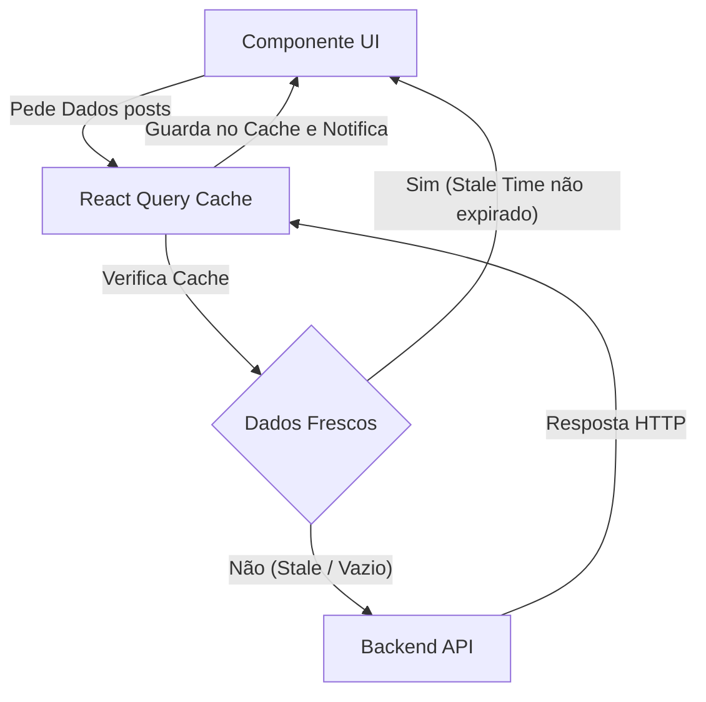

# Server State, Mutações e React Query

Se você já construiu um sistema `useEffect` para fazer fetch em uma API, teve que criar manualmente três estados: `data`, `isLoading` e `error`. Teve que lidar com condições de corrida (Race Conditions), abortar requisições quando o usuário muda de página rapidamente e descobrir como armazenar as informações em cache para não bombardear seu backend.

Neste nível especialista, aceitamos uma verdade fundamental: **Os dados que vêm do backend NÃO são estado da aplicação (Client State), são Estado do Servidor (Server State).**

## 1. A Mudança de Paradigma: TanStack Query (React Query)

Zustand e Redux são perfeitos para UI (Se um painel está aberto, o tema atual, um carrinho na memória). Mas para gerenciar APIs e banco de dados, o padrão absoluto da indústria é o **TanStack Query**.



## 2. Eliminando o useEffect para sempre

Vejamos como um especialista obtém dados de uma API sem um único `useEffect`, `useState` ou bloqueios de simultaneidade.

```jsx
import { useQuery } from '@tanstack/react-query';
import axios from 'axios';

// 1. Separamos a função pura de fetch (Agnóstica do React)
const fetchUsuarios = async () => {
  const { data } = await axios.get('https://api.empresa.com/v1/usuarios');
  return data;
};

export const ListaUsuarios = () => {
  // 2. A Mágica do React Query
  const { data: usuarios, isLoading, isError, error } = useQuery({
    queryKey: ['usuarios', 'lista'], // O ID único para este cache
    queryFn: fetchUsuarios,
    staleTime: 1000 * 60 * 5, // Confia no cache por 5 minutos antes do refetch
  });

  if (isLoading) return <Spinner />;
  if (isError) return <Alert msg={error.message} />;

  return (
    <ul>
      {usuarios.map(u => <li key={u.id}>{u.nome}</li>)}
    </ul>
  );
};
```

### O Poder do Cache Global
Se outro componente em outra visualização do aplicativo fizer um `useQuery` com a mesma key `['usuarios', 'lista']`, o React Query **não fará a requisição HTTP**. Ele fornecerá instantaneamente os dados da memória RAM (Cache Hit), reduzindo a latência para 0 ms.

## 3. Mutações: Modificando o Servidor

Ler dados é fácil; modificá-los e invalidar o cache (para que a interface seja atualizada) é o verdadeiro desafio. O `useMutation` lida com atualizações, criação e exclusão.

```jsx
import { useMutation, useQueryClient } from '@tanstack/react-query';

export const FormularioCrear = () => {
  const queryClient = useQueryClient();

  const mutation = useMutation({
    mutationFn: (novoUsuario) => axios.post('/api/usuarios', novoUsuario),
    // Lifecycle hook: Quando o servidor responder OK (200)
    onSuccess: () => {
      // Invalida o cache da lista de usuários.
      // Isso força o React Query a fazer um refetch automático em segundo plano!
      queryClient.invalidateQueries({ queryKey: ['usuarios', 'lista'] });
    },
  });

  const onSubmit = (dados) => {
    mutation.mutate(dados);
  };

  return (
    <button 
      onClick={() => onSubmit({ nome: 'Bob' })}
      disabled={mutation.isPending} // Controle automático do botão
    >
      {mutation.isPending ? 'Guardando...' : 'Criar Usuário'}
    </button>
  );
};
```

Com o React Query, seu código é reduzido em 50%, seu backend respira graças ao cache e o usuário percebe um aplicativo ultrarrápido. No nível de **Otimizações**, nos concentraremos nos gargalos de renderização local do navegador: Memoização, Profiling e Code Splitting massivo.
