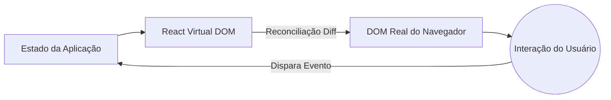

# Conceitos Iniciais e Ciclo de Vida Moderno

Bem-vindo ao ecossistema moderno do React. Ficaram para trás os dias das Classes e dos ciclos de vida monstruosos (`componentDidMount`, `componentWillReceiveProps`). Hoje, o React é funcional, declarativo e extremamente rápido se usado corretamente.

## 1. O Paradigma Declarativo

Ao contrário do JavaScript Vanilla (Imperativo), onde você diz ao navegador *como* fazer cada passo (criar elemento, adicionar classe, anexar ao DOM), no React você diz *o que* você quer que seja desenhado, e o React se encarrega do *como*.



## 2. Componentes Funcionais (O Padrão)

Um componente no React é simplesmente uma função pura do JavaScript que recebe dados (Props) e retorna JSX (uma sintaxe híbrida entre JS e HTML).

```jsx
// Um componente perfeito e puro
export const TarjetaUsuario = ({ nome, rol }) => {
  return (
    <div className="tarjeta">
      <h2>{nome}</h2>
      <p>Papel: {rol}</p>
    </div>
  );
};
```

### Por que JSX?
O JSX não é HTML real. É açúcar sintático para `React.createElement()`. Sob o capô, o React transforma essas tags em objetos JavaScript, permitindo que o *Virtual DOM* realize comparações matemáticas (diffing) a uma velocidade que o DOM real jamais poderia alcançar.

## 3. O Motor da Mudança: O Virtual DOM

Quando você altera o estado do seu aplicativo, o React não destrói e reconstrói toda a página da web (como faziam os frameworks antigos).

1. **Snapshot:** O React tira uma "foto" do novo Virtual DOM.
2. **Diffing:** Compara a nova foto com o Virtual DOM anterior usando um algoritmo heurístico de O(n).
3. **Reconciliação (Patching):** Aplica apenas as alterações matematicamente exatas ao DOM real.

Se apenas o número de "Curtidas" (Likes) em um botão mudou, o React viajará diretamente para esse nó do DOM e atualizará o texto, deixando intacto o resto da árvore (imagens, formulários).

## Próximos Passos
Entendemos como o React desenha a tela. No **Nível Básico**, exploraremos como dar "memória" aos nossos componentes utilizando Hooks (`useState` e `useEffect`), o coração do React moderno.
