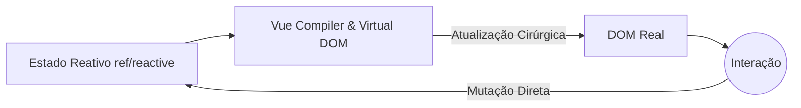

# Conceitos Iniciais e Reatividade

Bem-vindo ao Vue.js, o framework progressivo. Ao contrário do React, o Vue utiliza um sistema de reatividade baseado em Proxies (no Vue 3) que torna o gerenciamento de estado muito mais intuitivo e menos propenso a renderizações desnecessárias.

## 1. O Paradigma Progressivo
O Vue é chamado de 'progressivo' porque você pode usá-lo para renderizar um único componente em uma página estática (como o jQuery) ou construir uma SPA (Single Page Application) completa usando o Vue Router e o Pinia.



## 2. Options API vs Composition API
No Vue 3, o padrão é a **Composition API** com `<script setup>`. Isso permite agrupar a lógica por funcionalidade em vez de ciclo de vida.

```html
<script setup>
import { ref } from 'vue'

const contador = ref(0)
const incrementar = () => contador.value++
</script>

<template>
  <div class="tarjeta">
    <h2>Contador: {{ contador }}</h2>
    <button @click="incrementar">Incrementar</button>
  </div>
</template>
```
