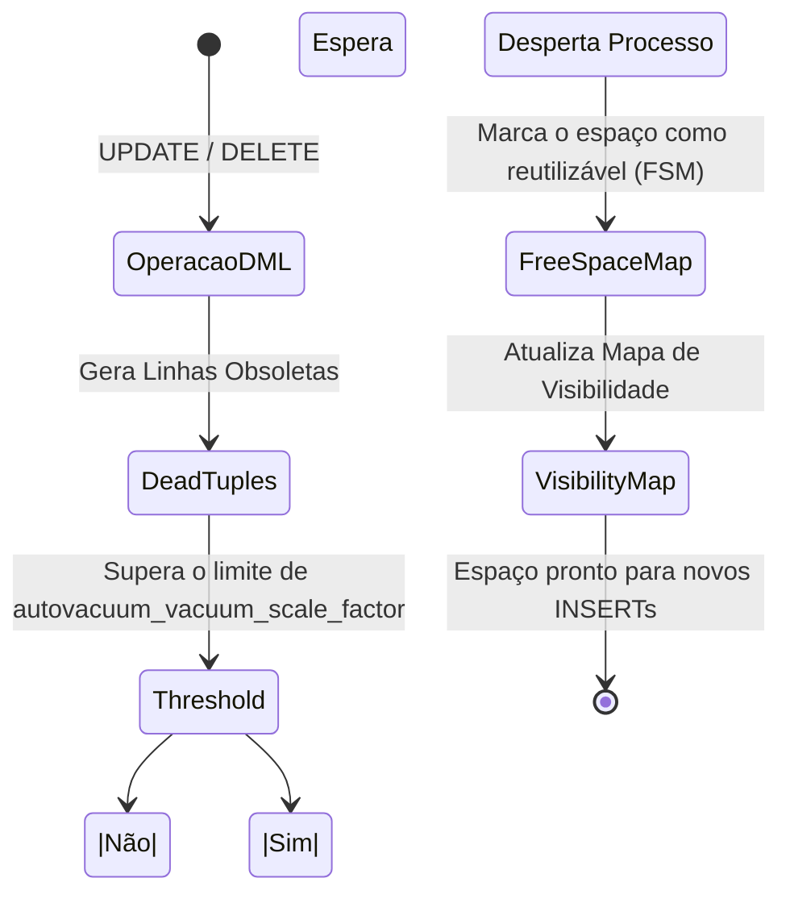

# Motor de Execução, Vacuum e Índices Compostos

No nível avançado, deixamos de escrever código cegamente e começamos a entender **como o PostgreSQL lê nosso código**. A diferença entre uma consulta que leva 5 minutos e uma que leva 50 milissegundos reside na compreensão do *Query Planner*.

## 1. A Arte do EXPLAIN ANALYZE

Nunca presuma que um índice está sendo utilizado. O PostgreSQL possui um otimizador baseado em custos (Cost-Based Optimizer). Se o motor calcular que fazer um *Sequential Scan* (ler toda a tabela) é mais barato do que usar o índice porque você está solicitando 80% dos dados, ele ignorará seu índice.

### Como ler um plano de execução

```sql
EXPLAIN ANALYZE 
SELECT * FROM sales.orders 
WHERE status = 'pending' AND total > 1000;
```

**Métricas Críticas a observar:**
- `Execution Time`: O tempo real que levou.
- `Buffers: shared hit=... read=...`: Se você vir muitos `read`, o Postgres está indo ao disco. Se você vir muitos `hit`, os dados estão sendo servidos da memória RAM (Excelente!).
- `Seq Scan`: Alarme vermelho se a tabela tiver milhões de linhas. Procure substituí-lo por um `Index Scan` ou `Bitmap Heap Scan`.

## 2. Índices Compostos e a Ordem das Colunas

Quando você filtra por múltiplas colunas, um índice simples não é suficiente.

```sql
-- Índice Composto
CREATE INDEX idx_orders_status_total ON sales.orders(status, total);
```
**Regra de Ouro:** A ordem importa. Sempre coloque primeiro a coluna que tem maior **cardinalidade** (a que descarta mais dados rapidamente) ou a coluna que você usa com operadores de igualdade (`=`). As colunas usadas para faixas (`>`, `<`) devem ir para o final do índice.

## 3. Autovacuum: O Coletor de Lixo do MVCC

No Nível Médio, aprendemos sobre o MVCC e as *dead tuples* (linhas obsoletas geradas por UPDATEs e DELETEs). Se essas linhas não forem limpas, seu banco de dados sofrerá de **Bloat** (inchaço), consumindo disco e destruindo o desempenho.

O processo `Autovacuum` é responsável por limpar isso.

### Diagrama do Processo Autovacuum



**Tuning Crítico para Tabelas Grandes:**
O valor padrão do Postgres (`autovacuum_vacuum_scale_factor = 0.2`) significa que o Autovacuum só é acionado quando 20% da tabela muda. Se você tem uma tabela de 100 milhões de linhas, 20 milhões de linhas teriam que mudar para limpá-la!
Ajuste isso por tabela:

```sql
ALTER TABLE sales.orders SET (autovacuum_vacuum_scale_factor = 0.01);
```

Compreender o EXPLAIN e dominar o Autovacuum separa um desenvolvedor sênior de um verdadeiro especialista em banco de dados. No nível **Especialista**, escalaremos isso para a replicação e o particionamento massivo.
