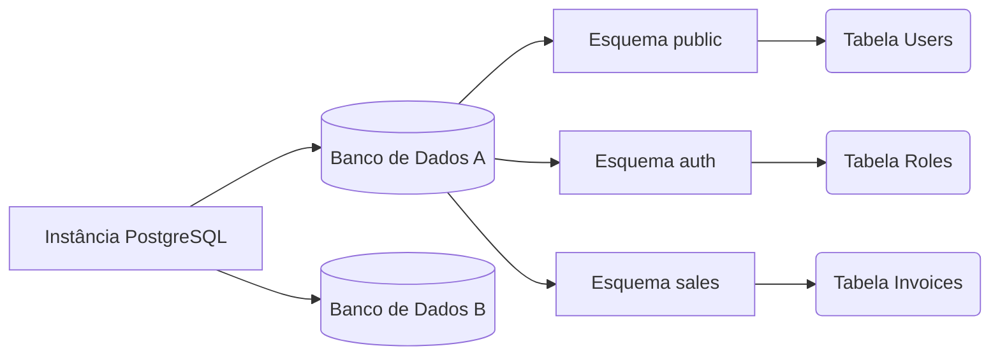

# Fundamentos, Tipos de Dados e Consultas Core

Já superamos a fase de infraestrutura. Agora entraremos no "campo de jogo" do desenvolvedor. PostgreSQL não é apenas um armazém de linhas e colunas; é um sistema de banco de dados Objeto-Relacional (ORDBMS). Isso significa que suporta herança, tipos de dados complexos e extensões.

## 1. O Paradigma dos Esquemas (Schemas)

Um erro muito comum entre desenvolvedores que migram do MySQL é usar o banco de dados como o único contêiner lógico de tabelas. No PostgreSQL, temos uma camada intermediária: o **Esquema (Schema)**.



Por padrão, todas as tabelas são criadas no esquema `public`. **Boa Prática:** Se você está construindo uma arquitetura monolítica ou de microsserviços com um único BD, divida seus domínios de negócios usando esquemas.

```sql
CREATE SCHEMA IF NOT EXISTS billing;
CREATE SCHEMA IF NOT EXISTS inventory;
```

## 2. Tipos de Dados: O Poder do JSONB e Arrays

O PostgreSQL destrói o mito de que "os bancos de dados SQL são rígidos". O Postgres suporta nativamente tipos de dados NoSQL com um desempenho excepcional.

### O tipo JSONB (JSON Binário)
Enquanto `JSON` salva texto simples, `JSONB` pré-processa o JSON em um formato binário personalizado. Isso torna a inserção um pouco mais lenta, mas as leituras e **buscas indexadas** incrivelmente rápidas.

```sql
CREATE TABLE billing.invoices (
    id UUID PRIMARY KEY DEFAULT gen_random_uuid(),
    customer_name VARCHAR(150) NOT NULL,
    total_amount NUMERIC(10, 2),
    metadata JSONB,
    created_at TIMESTAMP WITH TIME ZONE DEFAULT NOW()
);

-- Inserção de dados NoSQL dentro de uma tabela relacional
INSERT INTO billing.invoices (customer_name, total_amount, metadata)
VALUES ('Acme Corp', 500.50, '{"tags": ["b2b", "premium"], "payment_gateway": "stripe", "tax_exempt": false}');
```

### Consultando o interior do JSONB
O PostgreSQL fornece operadores especiais (como `->>` e `@>`) para pesquisar dentro do documento:

```sql
-- Buscar todas as faturas processadas pelo Stripe
SELECT customer_name, total_amount 
FROM billing.invoices 
WHERE metadata @> '{"payment_gateway": "stripe"}';

-- Extrair a primeira tag da lista
SELECT metadata->'tags'->>0 AS primary_tag 
FROM billing.invoices;
```

## 3. Integridade Referencial Estrita (Constraints)

Um esquema bem projetado não confia que o código do Frontend ou do Backend filtre os erros; o banco de dados é a **última linha de defesa**.

```sql
CREATE TABLE inventory.products (
    id SERIAL PRIMARY KEY,
    sku VARCHAR(20) UNIQUE NOT NULL,
    price NUMERIC(8,2) CHECK (price > 0),
    discount_percentage INT DEFAULT 0 CHECK (discount_percentage BETWEEN 0 AND 100),
    status VARCHAR(20) DEFAULT 'draft' CHECK (status IN ('draft', 'active', 'archived'))
);
```
O uso indiscriminado de constraints `CHECK` garante que *nunca* entrará um produto com preço negativo, não importa quantos bugs a sua API em Node.js ou Python tenha.

## 4. Introdução aos Índices B-Tree

O Índice B-Tree (Árvore Balanceada) é o cavalo de batalha do Postgres. É o índice padrão e é otimizado para operadores de igualdade e faixas (`<`, `<=`, `=`, `>=`, `>`).

```sql
-- Criando um índice B-Tree clássico para acelerar buscas
CREATE INDEX idx_products_sku ON inventory.products(sku);

-- Índice parcial: Apenas indexa as linhas que cumprem a condição.
-- Economiza muito espaço em disco e memória RAM.
CREATE INDEX idx_active_products ON inventory.products(status) WHERE status = 'active';
```

### Quando usar índices parciais?
Se você tem uma tabela de "Usuários" com 10 milhões de registros, mas apenas 50.000 estão marcados como `is_deleted = false`, um índice parcial sobre os usuários ativos será microscópico e ultra-rápido em comparação a indexar a tabela inteira.

## Reflexão de Fechamento
Dominar os tipos `JSONB`, usar esquemas lógicos e proteger suas informações com constraints `CHECK` transformará seus bancos de dados de simples planilhas glorificadas em cofres de dados robustos. No **Nível Médio**, exploraremos a arte obscura das consultas complexas: *Common Table Expressions (CTEs)* e *Window Functions*.
