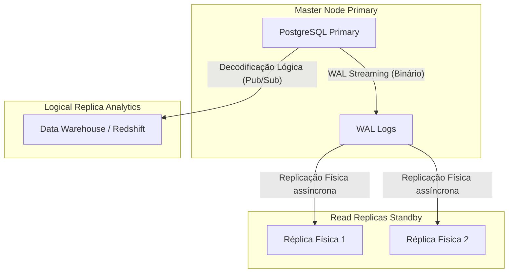

# Replicação e Particionamento Massivo

Quando uma única instância do PostgreSQL já não pode lidar com a carga de leitura ou o volume de armazenamento (estamos falando de Terabytes de dados), entramos no domínio Especialista. É hora de distribuir a carga.

## 1. Particionamento Declarativo (Sharding Local)

Se você tem uma tabela `logs` com 500 milhões de registros, tentar excluir dados antigos com um `DELETE` bloqueará a tabela e gerará um colapso de desempenho. A solução é dividir fisicamente a tabela mantendo uma única tabela lógica.

### Exemplo: Particionamento por Tempo (Faixa)

```sql
-- 1. Criar a tabela "Pai"
CREATE TABLE telemetry.sensor_logs (
    id UUID,
    sensor_id INT,
    reading NUMERIC,
    created_at TIMESTAMP NOT NULL
) PARTITION BY RANGE (created_at);

-- 2. Criar as tabelas "Filhas" (Físicas)
CREATE TABLE sensor_logs_y2023m10 PARTITION OF telemetry.sensor_logs
    FOR VALUES FROM ('2023-10-01') TO ('2023-11-01');

CREATE TABLE sensor_logs_y2023m11 PARTITION OF telemetry.sensor_logs
    FOR VALUES FROM ('2023-11-01') TO ('2023-12-01');
```

**Vantagem Crítica:** Quando o mês de outubro não for mais útil, você não faz um `DELETE`. Simplesmente faz um `DROP TABLE sensor_logs_y2023m10;`. Esta operação libera Gigabytes de espaço instantaneamente sem afetar o desempenho do servidor.

## 2. Topologia de Replicação: Streaming vs Lógica

Para escalar leituras ou garantir Alta Disponibilidade (HA), você precisa de réplicas.



### Replicação Física (Streaming Replication)
Copia o banco de dados inteiro, bloco por bloco, lendo os Write-Ahead Logs (WAL). As réplicas físicas são **somente leitura**. É ideal para fazer failover (se o master morrer, uma réplica assume o trono).

### Replicação Lógica (Pub/Sub)
Em vez de copiar blocos binários crus, o Postgres decodifica os WAL em eventos da camada de aplicação (`INSERT`, `UPDATE`, `DELETE`) e os envia aos assinantes.
- Permite replicar **apenas certas tabelas** (ideal para enviar tabelas de vendas para um Data Lake).
- Permite que o nó de destino possa escrever em suas próprias tabelas independentes.

```sql
-- No servidor Master:
CREATE PUBLICATION sales_pub FOR TABLE sales.orders, sales.invoices;

-- No servidor Analítico:
CREATE SUBSCRIPTION sales_sub CONNECTION 'host=master_ip port=5432 user=rep_user password=secret' PUBLICATION sales_pub;
```

Dominar o particionamento e a replicação permite escalar o Postgres virtualmente ao infinito. No **Nível Mestre (Otimizações)**, exploraremos o ajuste do Kernel e o pooling de conexões para levar o hardware ao seu limite absoluto.

