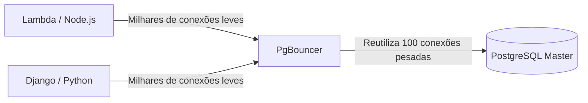

# Tuning Extremo, PgBouncer e Otimizações

Bem-vindo ao nível final. Aqui não escrevemos SQL; aqui modificamos o comportamento do Kernel do Linux e manipulamos a alocação de memória bruta para extrair cada grama de desempenho do hardware que suporta nosso banco de dados.

## 1. O Problema das Conexões (Connection Pooling)

Como vimos no Nível Inicial, o Postgres faz um *fork* (cria um novo processo) para cada conexão de cliente. Cada processo consome aproximadamente de 2 a 10 MB de RAM. Se a sua API Serverless (ex. AWS Lambda) abrir 5.000 conexões concorrentes, o Postgres consumirá toda a memória do servidor apenas em processos inativos, causando um *Out of Memory (OOM) Crash*.

### Arquitetura com PgBouncer

A solução obrigatória em produção é colocar um **Connection Pooler** na frente do banco de dados. O `PgBouncer` é o padrão da indústria.



O PgBouncer mantém um pequeno grupo de conexões ativas com o Postgres. Quando uma API pede para fazer uma consulta, o PgBouncer empresta uma conexão, executa a consulta e a devolve ao pool imediatamente (*Transaction Pooling*). Isso reduz a carga da CPU do Postgres a quase zero na gestão de conexões.

## 2. Tuning Extremo: Modificando postgresql.conf

O arquivo padrão `postgresql.conf` está configurado para rodar em um Raspberry Pi (ou seja, usa o mínimo de recursos). Se você está rodando em um servidor com 64GB de RAM e discos NVMe, está desperdiçando 95% do seu hardware.

### Parâmetros Vitais de Otimização (Exemplo para Servidor 64GB RAM):

```conf
# 1. Memória Compartilhada (Armazenamento cache de tabelas)
# Recomendado: 25% a 40% da RAM total.
shared_buffers = 16GB 

# 2. Memória para Ordenações (Sorts, Hashes)
# Memória por cada conexão. Cuidado: Se houver 100 conexões fazendo um SORT enorme, consumirá 100 * 64MB.
work_mem = 64MB 
maintenance_work_mem = 2GB # Apenas para VACUUM e criação de INDEX.

# 3. Ajuste de Discos SSD (Evitar o comportamento de discos rotacionais HDD)
random_page_cost = 1.1 # Assume leituras aleatórias quase tão rápidas quanto as sequenciais.
effective_io_concurrency = 200 # Aumenta o processamento I/O assíncrono para SSDs.

# 4. Transações e WAL
wal_level = logical # Preparado para replicação lógica, se necessário
checkpoint_completion_target = 0.9 # Suaviza as escritas no disco durante checkpoints
```

## 3. Huge Pages no Linux (Tuning do Sistema Operacional)

Para bancos de dados de alto desempenho, o sistema operacional gasta muita CPU administrando as "páginas de memória" de 4KB padrão. Habilitar **Huge Pages** (páginas de 2MB ou 1GB) permite que o Postgres gerencie seu `shared_buffers` com uma fração do esforço da CPU.

1. Calcular o tamanho do `shared_buffers`.
2. Configurar `/etc/sysctl.conf` no Linux:
   ```bash
   vm.nr_hugepages = 8500
   ```
3. Dizer ao Postgres para usá-las em `postgresql.conf`:
   ```conf
   huge_pages = on
   ```

Você alcançou a maestria. Da sintaxe básica até a configuração do Kernel, sua infraestrutura PostgreSQL agora está preparada para operar em escala global, tolerar falhas catastróficas e processar milhões de transações por segundo.
