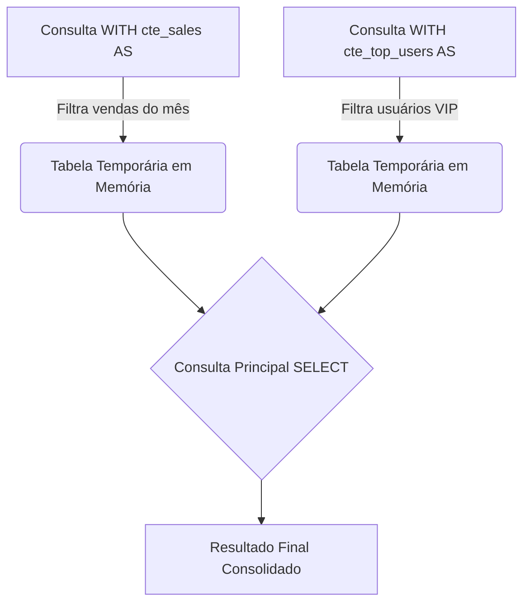
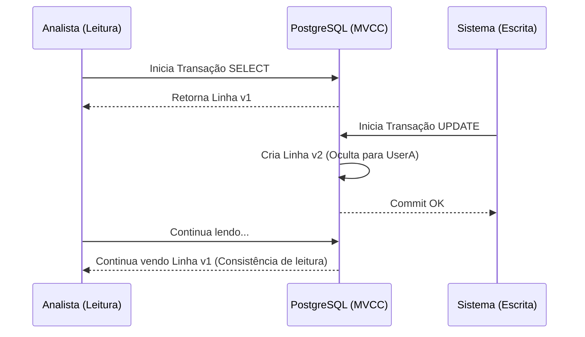

# Consultas Avançadas, CTEs e Transações ACID

Quando o `SELECT` e o `JOIN` básico já não são suficientes para processar a lógica de negócios, entramos no Nível Médio. Aqui transformamos o PostgreSQL de um simples armazém de dados em um **motor de computação analítica**. Mover a computação para o banco de dados (onde vivem os dados) é quase sempre mais eficiente do que enviar gigabytes de dados através da rede para o seu servidor Node.js ou Python.

## 1. Common Table Expressions (CTEs): Limpando o Espaguete SQL

As subconsultas aninhadas podem se transformar rapidamente em um inferno de manutenção. As CTEs (cláusula `WITH`) permitem definir blocos de resultados temporários e legíveis.

### Diagrama de Fluxo CTE



### Exemplo Prático
Imagine que queremos calcular o ticket médio dos nossos "Top Customers" sem fazer um espaguete de SQL:

```sql
WITH top_customers AS (
    SELECT customer_id, SUM(total_amount) as lifetime_value
    FROM billing.invoices
    GROUP BY customer_id
    HAVING SUM(total_amount) > 10000
),
recent_invoices AS (
    SELECT customer_id, total_amount
    FROM billing.invoices
    WHERE created_at >= NOW() - INTERVAL '30 days'
)
-- Consulta principal unindo as CTEs
SELECT t.customer_id, t.lifetime_value, AVG(r.total_amount) as avg_recent_ticket
FROM top_customers t
JOIN recent_invoices r ON t.customer_id = r.customer_id
GROUP BY t.customer_id, t.lifetime_value;
```

## 2. Window Functions: A Magia da Analítica

As *Window Functions* permitem realizar cálculos sobre um conjunto de linhas que estão relacionadas com a linha atual, **sem agrupá-las (sem colapsar os resultados como faz o `GROUP BY`)**.

Você quer saber qual posição (ranking) tem o salário de um funcionário dentro de seu próprio departamento, mantendo os detalhes do funcionário?

```sql
SELECT 
    employee_name, 
    department, 
    salary,
    RANK() OVER (PARTITION BY department ORDER BY salary DESC) as salary_rank,
    salary - AVG(salary) OVER (PARTITION BY department) as diff_from_dept_avg
FROM hr.employees;
```
Neste código mágico:
- `PARTITION BY` cria subgrupos (janelas) por departamento.
- A consulta retorna TODAS as linhas dos funcionários, mas adiciona colunas computadas analiticamente que observam toda a sua janela.

## 3. Transações e Controle de Concorrência (MVCC)

O PostgreSQL cumpre com **ACID** (Atomicidade, Consistência, Isolamento, Durabilidade) graças à sua arquitetura MVCC (*Multi-Version Concurrency Control*).

### O que é MVCC?
Quando você atualiza uma linha no Postgres, o motor **não sobrescreve** os dados no disco. Em vez disso, ele marca a linha antiga como "obsoleta" (dead tuple) e insere uma nova versão da linha. Isso significa que **os leitores nunca bloqueiam os escritores, e os escritores nunca bloqueiam os leitores.**



### Transações Explícitas
Agrupar operações críticas garante que o estado do banco de dados seja consistente.

```sql
BEGIN; -- Inicia a transação

UPDATE accounts SET balance = balance - 100 WHERE id = 1;
UPDATE accounts SET balance = balance + 100 WHERE id = 2;

-- Se algo falhar aqui no seu código, você faz um ROLLBACK;
-- Se tudo estiver bem, você confirma:
COMMIT; 
```

## 4. Upsert (INSERT ... ON CONFLICT)

O padrão *Upsert* resolve as corridas de concorrência ao tentar inserir um registro que poderia já existir. Em vez de fazer um `SELECT` (para verificar) e depois um `INSERT` ou `UPDATE` do backend (o que é lento e propenso a condições de corrida), faça isso atomicamente:

```sql
INSERT INTO analytics.daily_stats (date, user_id, visits)
VALUES ('2023-10-01', 105, 1)
ON CONFLICT (date, user_id) 
DO UPDATE SET visits = analytics.daily_stats.visits + 1;
```

Com essas ferramentas, você deixou para trás a escrita de SQL monolítico. Você está escrevendo código limpo, declarativo e matematicamente robusto. No **Nível Avançado**, mergulharemos no subsolo do motor: os Planos de Execução (EXPLAIN) e a limpeza interna (Vacuum).
