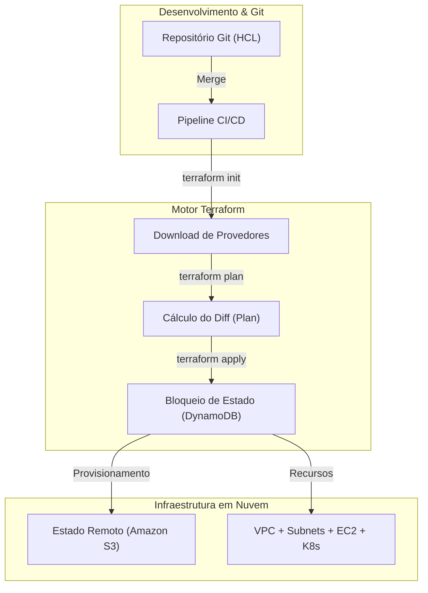

# Infraestrutura como Código e Imutabilidade (IaC & Terraform)

**Infrastructure as Code (IaC)** é a prática fundamental de DevOps para provisionar e gerenciar infraestrutura por meio de código declarativo auditável.

## 1. Paradigma Declarativo

Com o **Terraform**, você declara o estado desejado da infraestrutura em código HCL.



## 2. Ciclo de Vida do Terraform

```bash
terraform init
terraform plan
terraform apply -auto-approve
terraform destroy
```

## 3. Estado Remoto e Bloqueio (S3 + DynamoDB)

```hcl
terraform {
  backend "s3" {
    bucket         = "nmerge-terraform-state-prod"
    key            = "global/s3/terraform.tfstate"
    region         = "us-east-1"
    dynamodb_table = "nmerge-terraform-locks"
    encrypt        = true
  }
}
```
