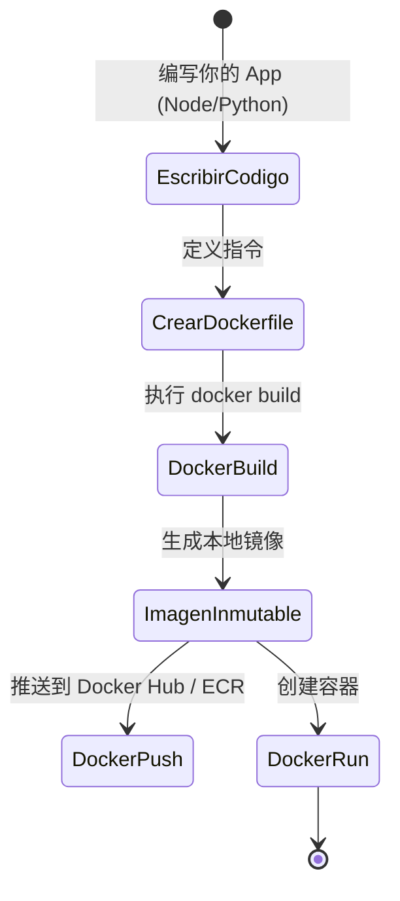

# Docker 基础：创建你自己的镜像（Dockerfile）

一旦你知道如何运行别人创建的容器（如 NGINX 或 Postgres），就该自己打包你的代码了。Docker 真正的魔力在于**不可变性（immutability）**：如果你今天打包了你的应用，它在 5 年后在你同事的电脑上或 AWS 服务器上的运行情况将完全一致。

## 1. 清单文件：什么是 Dockerfile？

`Dockerfile` 是一个纯文本文件（没有扩展名），包含了一系列逻辑指令，Docker 会自上而下读取它来组装一个镜像。

### 打包生命周期



## 2. 构建一个 Web 应用（Node.js）

假设我们有一个非常简单的 Node.js API。我们的项目具有以下结构：

```text
/mi-proyecto
├── package.json
├── package-lock.json
├── server.js
└── Dockerfile
```

### 标准 Dockerfile

创建 `Dockerfile` 文件并添加以下层级：

```dockerfile
# 1. 基础层：永远不要在生产环境中使用 'latest' 标签。请使用固定版本。
FROM node:18-alpine

# 2. 工作目录：接下来的所有操作都将在容器内的这个文件夹中执行
WORKDIR /usr/src/app

# 3. 依赖缓存：首先**只**复制依赖文件。
# 这对于利用 Docker 的层级缓存至关重要。
COPY package*.json ./

# 4. 安装：执行包管理器。只有当 JSON 文件发生改变时，这一步才会重新执行。
RUN npm install --production

# 5. 源代码：现在我们复制应用的其余部分。
COPY . .

# 6. 环境变量和端口：声明应用监听的端口（仅作文档说明用）。
EXPOSE 3000
ENV NODE_ENV=production

# 7. 运行：当容器启动时的默认命令。
CMD ["node", "server.js"]
```

## 3. 层缓存的威力（Layer Caching）

为什么我们要把 `COPY package*.json` 和 `COPY . .` 分开？
Docker 会缓存每一行的结果。如果你只是更改了代码中（`server.js`）的一个按钮的颜色，Docker 将重用依赖安装（`npm install`）的缓存，因为 `package.json` 文件没有改变。如果你把所有的东西一起复制（`COPY . .` 紧跟 `RUN npm install`），仅仅是一个简单的文本修改也会迫使 Docker 重新安装所有的依赖，使你的部署变得极其缓慢。

## 4. 构建并运行

我们的 `Dockerfile` 准备好后，我们告诉 Docker 构建镜像（点 `.` 表示在当前目录中寻找 Dockerfile）：

```bash
docker build -t mi-api-node:v1 .
```

构建完成后，我们启动容器：

```bash
docker run -d --name backend-api -p 3000:3000 mi-api-node:v1
```

## 5. 保护盾：.dockerignore

如果你在 Node.js 项目中执行 `docker build`，你可能会面临将本地机器上巨大的 `node_modules` 文件夹复制到容器中的风险，覆盖容器原生的安装（这可能使用了不同的 CPU 架构）。

为了避免这种情况，请**务必**创建一个 `.dockerignore` 文件：

```text
node_modules
npm-debug.log
.git
.env
```

掌握了这些基础之后，你已经准备好不再运行孤立的容器了。在**中级**中，我们将学习使用 **Docker Compose** 在一个编排的网络中连接多个服务（比如你的 Node.js API 和一个 PostgreSQL 数据库）。
