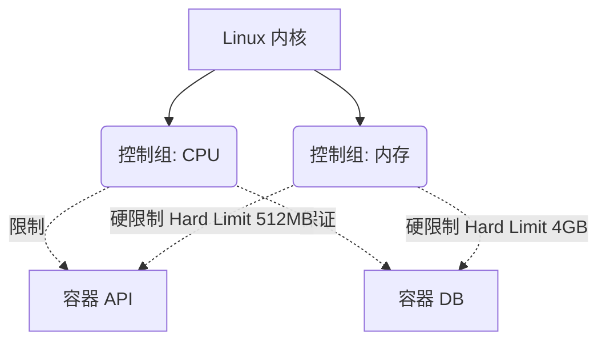

# Docker 专家：内核限制、CGroups 和安全

你已经学会了构建和编排高度优化的镜像。但在生产环境中运行容器而不去管理它们的资源，简直就是系统性灾难的秘方。在专家级别，我们将深入 Linux 内核的底层。

Docker 是如何防止一个存在内存泄漏（Memory Leak）的容器消耗物理服务器 100% 的 RAM，从而导致其他应用程序崩溃的？答案是 **CGroups (控制组 Control Groups)** 和 **Namespaces (命名空间)**。

## 1. 物理隔离 vs 逻辑隔离

- **Namespaces (命名空间)：** 它们对容器“撒谎”。它们让容器相信自己拥有独立的硬盘、独立的网络系统以及独立的进程树（PID 1）。这是*逻辑*隔离。
- **CGroups (控制组)：** 它们给容器戴上了“手铐”。它们在物理上限制容器可以向下层硬件请求的 CPU、RAM 和 I/O 的数量。这是*物理*隔离。

### 资源控制架构



## 2. 实施硬限制 (Hard Limits)

如果一个容器超过了分配给它的内存限制，Linux 内核会调用臭名昭著的 **OOM Killer (Out Of Memory Killer)**，并立即终止该容器的进程，以拯救宿主操作系统。

始终在你的 `docker-compose.yml` 中应用严格的策略（特别是使用 V3/Compose 规范中的 *Deploy* 配置）：

```yaml
services:
  data-processor:
    image: python-worker:latest
    deploy:
      resources:
        limits:
          cpus: '0.50'     # 最多半个物理 CPU 核心
          memory: 512M     # 如果达到 513MB，OOM Killer 将介入
        reservations:
          cpus: '0.10'     # 调度器保证的最小 CPU
          memory: 128M     # 保留的最小内存
```

有了此配置，Python worker 中一个编写糟糕的 `while(True)` 无限循环只会影响 50% 的单个内核，从而保持主服务器 100% 的稳定。

## 3. 专家级安全：移除能力 (Drop Capabilities) 与非 root (Non-Root) 用户

默认情况下，Docker 容器内部的主进程以 **root** 用户身份运行。这是一个巨大的风险。如果发生容器逃逸 (Container Breakout)，攻击者将在宿主服务器上拥有超级用户权限。

### 规则 1：非特权用户
修改 Dockerfile 的末尾，在执行应用程序之前降低权限。

```dockerfile
# ... (之前的配置) ...

# 创建一个没有 shell 和权限的系统用户
RUN addgroup -S appgroup && adduser -S appuser -G appgroup

# 将文件的所有权分配给该用户
RUN chown -R appuser:appgroup /usr/src/app

# 将上下文切换到安全用户
USER appuser

# 直到现在才启动服务器
CMD ["node", "server.js"]
```

### 规则 2：移除内核能力 (Capabilities)
即使作为 `root`，Linux 也会将超级用户权限划分为称为 "Capabilities" 的块。默认情况下的容器保留了太多权限（比如允许 Ping 和网络欺骗的 `CAP_NET_RAW`）。

在生产环境中，你应该移除 (drop) 所有的 capabilities，并且只恢复严格需要的那些。

```yaml
services:
  web:
    image: nginx:alpine
    cap_drop:
      - ALL # 销毁所有的内核特权
    cap_add:
      - NET_BIND_SERVICE # 仅允许绑定到低端口 (<1024)
    security_opt:
      - no-new-privileges:true # 防止内部提权
```

## 专家总结
一位熟练的容器架构师会假定容器将会遭到破坏并被注入恶意代码。通过应用严格的 Cgroups 限制、作为`非特权 USER`运行进程以及移除内核的 `Capabilities`，你可以确保攻击的爆炸半径 (Blast Radius) 为零。在**大师**级别，我们将把这些理念扩展到全局编排。
