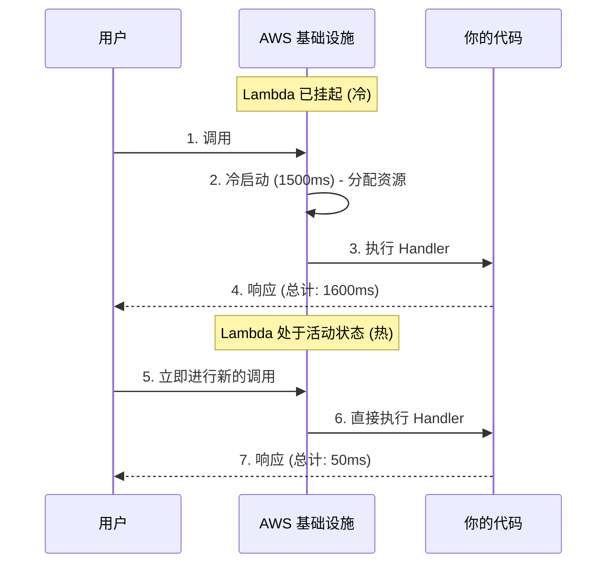

# AWS 基础：掌握 AWS Lambda 与冷启动 (Cold Start)

AWS Lambda 是 Serverless 架构的绝对核心。它是一个短暂的计算环境。实际上，AWS 将你的代码加载到一个微型容器中，执行它，根据使用的毫秒数向你收费，然后将其销毁。

## 1. Lambda 的解剖学

一个 Lambda 函数在其签名 (signature) 中始终包含三个基本要素。

```javascript
// index.mjs
export const handler = async (event, context) => {
  try {
    // 1. 事件 (EVENT): 包含触发器的数据 (S3, API Gateway, SQS)
    const body = JSON.parse(event.body);
    
    // 2. 上下文 (CONTEXT): 环境的元数据 (剩余时间, Request ID)
    const tiempoRestante = context.getRemainingTimeInMillis();

    if (body.action === 'procesar') {
       return { statusCode: 200, body: "处理完成!" };
    }

  } catch (error) {
    console.error("严重错误:", error);
    return { statusCode: 500, body: "内部错误" };
  }
};
```

### 铁一般的限制 (硬性限制)
在设计架构时，你必须考虑这些 Lambda 的限制：
* **最长执行时间：** 15 分钟。（如果你需要几个小时，请使用 AWS Batch 或 Fargate）。
* **最大内存：** 10 GB。
* **临时层 (`/tmp`)：** 最大 10 GB 的临时存储，且会消失。

## 2. 头号敌人：冷启动 (Cold Start)

如果你的 Lambda 在过去几分钟内没有被调用过，AWS 会将其挂起以节省资源。当新的请求到达时，AWS 必须：
1. 寻找有空间的物理服务器。
2. 从内部存储桶下载你的代码。
3. 启动环境 (Node.js, Python)。
4. 执行函数。

这个过程被称为**冷启动 (Cold Start)**。它可能需要 300 毫秒到 3 秒的时间，这对用户体验来说是灾难性的。



### 基本缓解策略
* **最小化包的大小：** 不要上传一个 200MB 的 `node_modules` 文件夹。使用 `esbuild` 或 `webpack` 将你的代码打包成一个 2MB 的压缩文件。
* **全局初始化：** 数据库连接必须在 `handler` 外部进行。

```javascript
import { Client } from 'pg';

// ✅ 正确：在冷启动期间执行，并在热调用中重复使用。
const db = new Client({ connectionString: process.env.DB_URL });
await db.connect();

export const handler = async (event) => {
  // 这将非常快。
  const res = await db.query('SELECT * FROM users');
  return { statusCode: 200, body: JSON.stringify(res.rows) };
};
```

在**中级阶段**，我们将了解如何使用 API Gateway 将我们的 Lambda 连接到外部世界，以及如何使用 DynamoDB 管理 Serverless 数据库。
