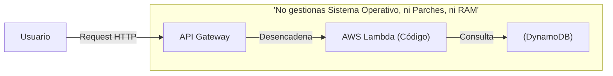

# Cloud Computing y Arquitectura sin Servidores

Bienvenido a la Nube. Durante décadas, hospedar una aplicación significaba alquilar servidores físicos (Bare-Metal). Luego pasamos a Máquinas Virtuales (EC2) y Contenedores (Docker). Hoy, el pináculo de la evolución es **Serverless**.

## 1. ¿Qué significa "Serverless"?

Serverless (Sin Servidor) no significa que los servidores mágicamente desaparecieron. Significa que **la gestión, escalabilidad y el mantenimiento de los servidores son completamente invisibles para ti.**



### Ventajas Radicales
* **Pago por Uso Real:** Si tu aplicación tiene 0 usuarios el fin de semana, pagas exactamente $0.00. (A diferencia de un VPS que cobra 24/7).
* **Escalado Infinito e Instantáneo:** Si pasas de 10 usuarios a 10,000 en un segundo, AWS clona tu código miles de veces automáticamente sin que hagas absolutamente nada.
* **Cero Mantenimiento:** Nunca tendrás que actualizar la versión de Linux o instalar un parche de seguridad de Kernel.

## 2. Los Pilares de AWS Serverless

El ecosistema Serverless de AWS se construye con tres piezas de lego fundamentales:

| Servicio | Función | Analogía Tradicional |
| :--- | :--- | :--- |
| **API Gateway** | El Portero. Recibe peticiones HTTP, valida Auth y enruta. | Nginx / Apache / Express Router |
| **AWS Lambda** | El Cerebro. Ejecuta tu código (Node.js, Python, Go) por milisegundos. | Tu Controlador / Lógica de Negocio |
| **DynamoDB** | La Memoria. Base de datos NoSQL de latencia de 1 milisegundo. | MongoDB / PostgreSQL |

## 3. El Cambio de Paradigma en el Código

En un servidor tradicional de Node.js, tú inicias el servidor escuchando en un puerto (`app.listen(3000)`). En Serverless, **tu código está "dormido"** hasta que un evento lo despierta.

```javascript
// Así luce una AWS Lambda. No hay servidor, solo una función pura.
export const handler = async (event) => {
  // El 'event' contiene todo lo que API Gateway recibió (Headers, Body)
  console.log("Evento Recibido:", event.body);
  
  return {
    statusCode: 200,
    body: JSON.stringify({ mensaje: "Hola desde la Nube Serverless!" }),
  };
};
```

## Próximos Pasos
Hemos entendido que Serverless es ejecución por eventos (Event-Driven Computing). En el **基础级**, exploraremos profundamente AWS Lambda, sus restricciones de tiempo, y el concepto del "Cold Start" (Arranque en frío).
