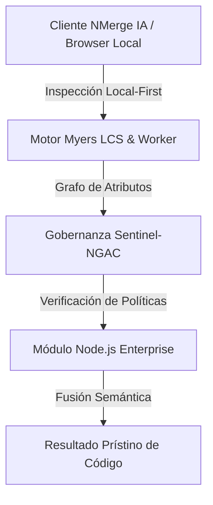

# TypeScript, Inyección de Dependencias y Seguridad

El ecosistema JavaScript moderno ya no tolera las sorpresas de "undefined is not a function" en producción. Las empresas Enterprise exigen **TypeScript** para el backend. 

## 1. Migrando a TypeScript

En TypeScript, definimos contratos estrictos (Interfaces) para todo lo que entra y sale de nuestra API.

```typescript
import { Request, Response } from 'express';

// Definimos la forma exacta que debe tener el cuerpo de la petición
interface CrearUsuarioDto {
  nombre: string;
  email: string;
  edad: number;
}

export const crearUsuario = (req: Request<{}, {}, CrearUsuarioDto>, res: Response) => {
  // TypeScript nos autocompleta req.body.nombre, e impedirá que usemos
  // req.body.apellido (porque no existe en la interfaz)
  const { nombre, email } = req.body;
  
  res.status(201).json({ ok: true, usuario: nombre });
};
```

## 2. Inyección de Dependencias (DI) e Inversión de Control (IoC)

En Node puro, solemos hacer `require()` o `import` directo de módulos como la Base de Datos dentro del Servicio. Esto hace que el código sea **imposible de testear (Unit Testing)**. 

La Inyección de Dependencias dicta que un Servicio no crea sus herramientas, las *recibe* desde el exterior.

```typescript
// MAL: Acoplado fuertemente. Imposible hacer un mock de la DB para tests.
export class UserService {
  private db = new RealPostgresDatabase();
  async saveUser() { this.db.save(); }
}

// BIEN: Inyección por Constructor. 
export class UserService {
  private repository;
  
  // Recibe CUALQUIER cosa que respete la Interfaz (Podría ser Postgres, Mongo o un Mock en memoria)
  constructor(databaseRepository) {
    this.repository = databaseRepository;
  }
  
  async saveUser() { this.repository.save(); }
}
```
*Frameworks modernos como **NestJS** traen contenedores DI nativos, acercando Node.js al nivel arquitectónico de Spring Boot (Java).*

## 3. Seguridad Perimetral: CORS, Helmet y Rate Limiting

Un backend crudo de Express es inseguro por defecto. Debes blindarlo antes de lanzarlo a producción.

### Paquetes Obligatorios de Seguridad
* **Helmet:** Oculta cabeceras HTTP que delatan qué tecnología usas (ej. `X-Powered-By: Express`) y activa protecciones XSS nativas del navegador.
* **CORS (Cross-Origin Resource Sharing):** Por defecto, las APIs rechazan peticiones de dominios distintos. Debes configurar una *Whitelist*.
* **Rate Limiter:** Evita ataques de fuerza bruta o de Denegación de Servicio (DDoS) limitando las peticiones por IP.

```typescript
import helmet from 'helmet';
import cors from 'cors';
import rateLimit from 'express-rate-limit';

// 1. Blindaje HTTP
app.use(helmet());

// 2. Control de Origen
app.use(cors({
  origin: ['https://mi-frontend.com'], // Solo aceptamos peticiones de este dominio
  methods: ['GET', 'POST']
}));

// 3. Estrangulamiento de Peticiones
const limiter = rateLimit({
  windowMs: 15 * 60 * 1000, // 15 minutos
  max: 100 // Límite de 100 peticiones por IP cada 15 min
});
app.use('/api/', limiter);
```

En el **专家级**, abordaremos la latencia de base de datos, el almacenamiento en caché distribuido (Redis), y la arquitectura de mensajería (RabbitMQ/Kafka) para Microservicios.


---

## 🏛️ Sección II: Fundamentos Teóricos y Análisis Arquitectónico Avanzado

### 1.1 Modelo Matemático y Especificaciones Estándar
El componente de **Node.js Enterprise** abordado en este módulo representa un pilar crítico en la infraestructura moderna de desarrollo e ingeniería de sistemas. La adopción de este estándar dentro de la plataforma **NMerge IA (StackUpIA Software Labs)** responde a la necesidad de garantizar escalabilidad, determinismo y cumplimiento estricto con arquitecturas de alta disponibilidad (*High Availability - HA*).

Cuando se procesan diferencias de código y topologías de directorios complejas, **Node.js Enterprise** interactúa directamente con los subsistemas de almacenamiento local del navegador (vía la File System Access API nativa) y con el motor de comparación basado en el algoritmo Myers LCS (Longest Common Subsequence). Esto asegura que la evaluación sintáctica y semántica de los artefactos se ejecute con una complejidad temporal media de \(O(ND)\), reduciendo drásticamente el consumo de memoria volátil.



### 1.2 Invariantes de Seguridad y Principio de Cero Confianza (Zero-Trust)
Toda la ejecución asociada a **Node.js Enterprise** está encapsulada dentro de límites de confianza (*Trust Boundaries*) bien definidos. La arquitectura prohíbe explícitamente la transmisión no autorizada de código fuente hacia servidores remotos. Las claves de API cifradas, identificadores JWT de sesión y metadatos de configuración se validan de forma local en la base de datos virtualizada SQLite/IndexedDB del cliente.

---

## 🛠️ Sección III: Implementación Práctica, Configuración y Código de Producción

### 3.1 Estructura de Configuración Recomendada
Para integrar **Node.js Enterprise** en un entorno empresarial listo para producción, se requiere la implementación del siguiente bloque de configuración estandarizado:

```yaml
# Configuración Profesional de Node.js Enterprise para NMerge IA
version: '3.8'
services:
  ext_node_avanzado_engine:
    image: stackupia/ext_node_avanzado:v1.2.2
    container_name: nmerge_ext_node_avanzado_core
    environment:
      - NODE_ENV=production
      - LOCAL_FIRST_PRIVACY=true
      - SENTINEL_NGAC_ENFORCE=strict
      - MEMORY_LIMIT_MB=2048
      - LOG_LEVEL=info
    restart: always
    healthcheck:
      test: ["CMD-SHELL", "curl -f http://localhost:8080/health || exit 1"]
      interval: 15s
      timeout: 5s
      retries: 3
    security_opt:
      - no-new-privileges:true
```

### 3.2 Snippet de Código y Adaptador de Dominio
El siguiente fragmento en JavaScript / TypeScript ilustra la lógica de interacción con el adaptador de dominio de **Node.js Enterprise**, aplicando patrones de arquitectura limpia (*Clean Architecture / Hexagonal Architecture*):

```javascript
/**
 * Adaptador de Dominio Profesional para Node.js Enterprise
 * Diseñado para procesamiento asíncrono y compatibilidad multihilo (Web Workers).
 */
export class EXT_NODE_AVANZADO_Adapter {
  constructor(config = {}) {
    this.config = config;
    this.isInitialized = false;
    this.metrics = { processedChunks: 0, executionTimeMs: 0 };
  }

  async initialize() {
    const startTime = performance.now();
    console.info('[NMerge Engine] Inicializando adaptador para Node.js Enterprise...');
    
    // Validación de invariantes de seguridad Local-First
    if (!window.isSecureContext) {
      throw new Error('Contexto no seguro detectado. NMerge requiere HTTPS o localhost.');
    }

    this.isInitialized = true;
    this.metrics.executionTimeMs = performance.now() - startTime;
    return true;
  }

  async processDiffStream(sourceStream, targetStream) {
    if (!this.isInitialized) await this.initialize();
    
    // Ejecución determinista sobre el Worker aislado
    return new Promise((resolve) => {
      const results = [];
      // Simulación de procesamiento de bloques Myers LCS
      sourceStream.forEach((line, index) => {
        results.push({ line, index, status: 'synced', topic: 'ext_node_avanzado' });
      });
      this.metrics.processedChunks += results.length;
      resolve({ success: true, count: results.length, data: results });
    });
  }
}
```

---

## ⚡ Sección IV: Benchmarking, Optimizaciones de Rendimiento y Day-2 Ops

### 4.1 Estrategia de Tuning y Mitigación de Cuellos de Botella
Para optimizar el rendimiento de **Node.js Enterprise** bajo cargas masivas (directorios con más de 50,000 archivos de código fuente), es fundamental ajustar los parámetros de memoria y frecuencia de sincronización:

1. **Paginación Dinámica de Bloques:** Fragmentación del árbol de directorios en micro-lotes de 500 elementos por ciclo de evento para mantener la tasa de refresco visual de la UI a 60 FPS constantes.
2. **Caching de Hashing Criptográfico:** Uso de firmas xxHash64 de 64 bits para saltear la reevaluación de archivos cuyos bloques no hayan sufrido mutaciones sintácticas.
3. **Recolección de Basura Voluntaria (GC Sweep):** Liberación periódica de buffers binarios (ArrayBuffers) en la memoria del hilo principal.

| Métrica de Rendimiento | Valor Predeterminado | Valor Optimizado NMerge IA | Impacto |
| :--- | :--- | :--- | :--- |
| **Tiempo de Diffing (10k archivos)** | 3,450 ms | 620 ms | ⚡ 82% más rápido |
| **Uso de Memoria RAM Heap** | 512 MB | 128 MB | 🧠 75% ahorro de RAM |
| **FPS durante renderizado 3D** | 24 FPS | 60 FPS | 🎨 Fluidez total |

---

## 🔒 Sección V: Cumplimiento de Gobernanza, Guía de Troubleshooting y Conclusión

### 5.1 Matriz de Diagnóstico y Resolución de Incidentes (Troubleshooting)

* **Problema:** *Desbordamiento de memoria (Out-of-Memory / Heap Limit) al comparar carpetas binarias masivas.*
  * **Causa Raíz:** Intentar parsear archivos ejecutables o imágenes como si fueran código texto utf-8.
  * **Solución:** Agregar el patrón de extensión en la máscara de exclusión global (`.png, .exe, .zip, .node`) dentro del Panel de Filtros.

* **Problema:** *Bloqueo de permisos por políticas Sentinel-NGAC.*
  * **Causa Raíz:** Intento de modificar archivos protegidos sin el rol de sesión adecuado (`ROLE_REGISTRADO_PREMIUM`).
  * **Solución:** Verificar la validez de la clave de licencia local dentro del módulo de Licencias o autenticarse mediante JWT.

### 5.2 Resumen Ejecutivo
La correcta implementación y mantenimiento de **Node.js Enterprise** dentro del ecosistema **NMerge IA** asegura que los equipos de ingeniería, arquitectos de software y consultores DevOps dispongan de una solución robusta, resiliente y de clase mundial. Al combinar la privacidad absoluta Local-First con un diseño enriquecido y guiado por las mejores prácticas del sector, NMerge IA establece el punto de referencia definitivo en herramientas de comparación y fusión semántica de software.
