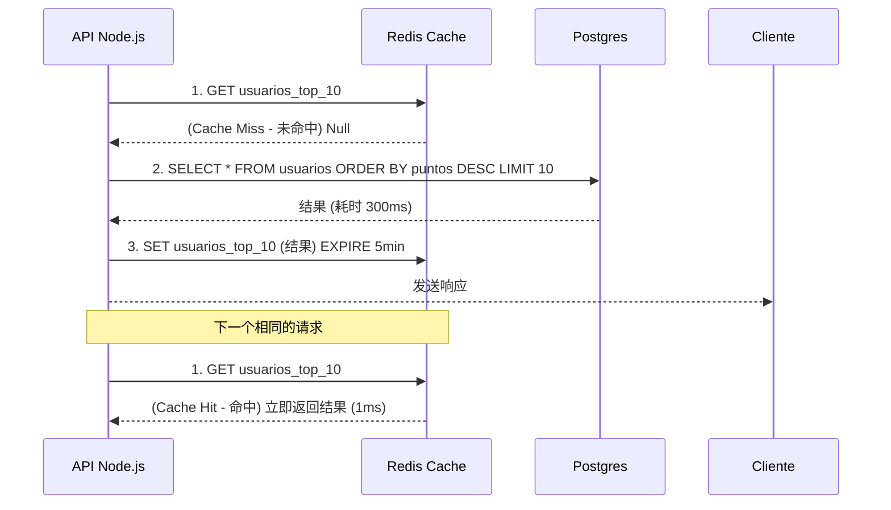

# Node.js 专家：微服务、Redis 缓存与消息传递 (事件驱动 Event-Driven)

当 Node.js 中的 REST API 扩展到支持一百万用户时，瓶颈就不再是事件循环了，而是数据库。每个 SQL 查询会增加 50ms 到 200ms。如果 10,000 个用户同时查询你的 App 首页，你的数据库就会崩溃。

## 1. 分布式缓存 (Redis)

Redis 是一个基于内存 (In-Memory，存在于 RAM 中) 的键值对 (key-value) 数据库。它的读取延迟小于 1ms。

它的核心模式是 **Cache-Aside Pattern (旁路缓存模式)**:



## 2. 事件驱动架构 (微服务)

在单体应用 (Monolito) 中，如果发生了一笔销售，你会按顺序调用函数：`crearOrden()` (创建订单)、`restarStock()` (减库存)、`enviarEmail()` (发送邮件)。如果发送邮件需要 3 秒钟，用户就必须一直等着。

在微服务中，我们使用**消息中间件 (Message Brokers)**（RabbitMQ, Kafka, AWS SQS）来解耦操作。

```javascript
// 支付服务 (Node.js)
const channel = await RabbitMQ.createChannel();

app.post('/pagar', async (req, res) => {
  const exito = await procesarTarjeta(req.body);
  
  if (exito) {
    // 发后不理 (Fire and Forget)
    // 我们向队列触发一个事件，并**立即**响应用户。
    channel.publish('ventas_exchange', 'pago.completado', Buffer.from(JSON.stringify(req.body)));
    
    return res.json({ msg: "您的订单正在处理中。" });
  }
});
```

同时，在完全独立的容器中（也许用 Python 或 Go 编写），其他微服务正在*监听*这个事件：
* **邮件服务** 监听 `pago.completado` 并发送收据。
* **库存服务** 监听 `pago.completado` 并减去库存。

## 3. JWT 与无状态会话 (Stateless)

分布式架构需要无状态 (Stateless) 身份验证。与其将会话保存在服务器的内存中（如果你在负载均衡器后面有 5 个 Node 实例，这将会崩溃），我们使用 **JSON Web Tokens (JWT)**。

JWT 将加密的授权信息包含在字符串*内部*。服务器不需要查询数据库来知道你是否是管理员；它只需使用其私钥签名 (`HMAC SHA256`) 在密码学上解密 JWT。

在**优化级别**中，我们将使用 Node 集群 (Clusters)、PM2，并分析工作线程 (Worker Threads) 以榨干裸机硬件的性能。
