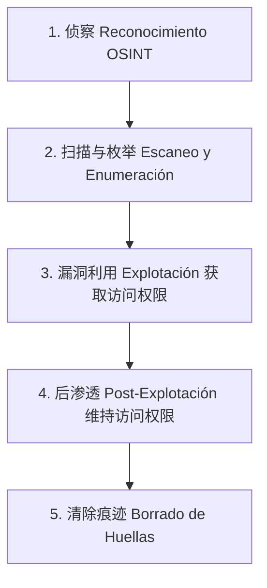

# 渗透测试初级 (Pentesting Inicial)：攻防安全基础

欢迎来到黑暗面。渗透测试 (Pentesting) 不是为了破坏，而是为了像攻击者一样思考，以便在真正的网络罪犯发现漏洞之前发现它们。

## 1. 攻击者的思维模式 (Mindset)

开发人员在构建时考虑的是“快乐路径” (Happy Path)。用户输入他们的电子邮件、密码，然后进入系统。
渗透测试人员（或攻击者）则专门思考如何破坏这条路径：
* 如果我输入的不是电子邮件，而是一百万个字符 `A` 会怎样？
* 如果我发送的不是一个字符串，而是一个嵌套的 JSON 对象会怎样？
* 如果我拦截请求并将我的用户 ID 更改为管理员的 ID 会怎样？

## 2. 基础工具 (瑞士军刀)

你不需要成为终端法师就能开始，但是行业内有一些标准工具（通常包含在像 Kali Linux 或 Parrot OS 这样的发行版中）：

| 工具 | 主要目的 |
| :--- | :--- |
| **Nmap** | 端口扫描器。发现服务器上有哪些服务 (SSH, HTTP, FTP) 是活跃的。 |
| **Burp Suite** | 拦截代理 (Proxy)。Web 黑客攻击的圣杯。 |
| **Metasploit** | 针对已知漏洞 (CVE) 的自动化漏洞利用框架。 |
| **Gobuster / DirBuster** | 发现隐藏路径 (模糊测试 Fuzzing)。寻找 `/admin`, `/respaldos.zip` 等。 |

## 3. 攻击面 (Superficie de Ataque) 的概念

你的 Web 应用程序不仅仅是你的 React 代码。“攻击面”是所有可能入口的总和：
* 你的 Web 服务器 (Nginx/Apache)。
* 数据库引擎 (PostgreSQL/MySQL)。
* 第三方库 (过时的 NPM 包)。
* 物理服务器上打开的端口。
* 员工本身 (社会工程学 Ingeniería Social)。

一条链条的强度取决于它最薄弱的一环。如果开发人员将数据库在没有密码的情况下在 5432 端口上暴露给互联网，那么用军用级算法 Argon2 加密密码也是毫无用处的。

## 后续步骤
我们已经了解了攻防理念。在**基础级别**中，我们将探索 Web 安全的圣经 OWASP Top 10，从历史上最臭名昭著和最致命的攻击开始：SQL 注入。
