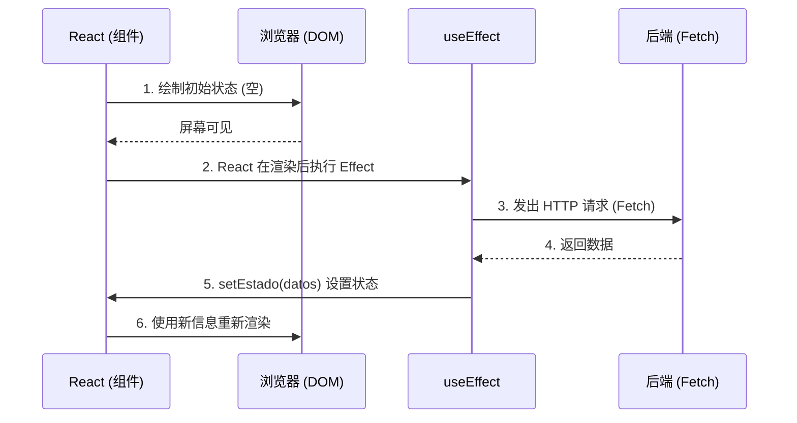

# React 基础：核心 Hooks 与本地状态管理

函数式组件本身是纯粹且没有记忆的（"Stateless" 无状态）。如果你调用一个函数两次，它是从零开始的。为了让组件在渲染周期之间“记住”信息（例如购物车或模态框是否打开），React 引入了 **Hooks（钩子）**。

## 1. 本地状态：useState

`useState` 是最关键的 hook。它为你的组件提供了一个私有的记忆库，该库能够在渲染周期中留存下来。

```jsx
import React, { useState } from 'react';

export const Contador = () => {
  // 1. 声明：'contador' 是值，'setContador' 是修改函数
  // 2. 初始化：从 0 开始
  const [contador, setContador] = useState(0);

  return (
    <div>
      <p>你已经点击了 {contador} 次</p>
      {/* 永远不要直接修改（例如：contador = contador + 1）。请始终使用 Setter */}
      <button onClick={() => setContador(contador + 1)}>
        增加
      </button>
    </div>
  );
};
```

### 状态的黄金法则：不可变性 (Immutability)
React 通过使用引用相等性（`===`）来比较新状态和旧状态是否不同，从而决定是否重新渲染屏幕。如果你有一个数组或对象，你**绝对不能**对它们进行 `.push()` 操作或直接修改它们的属性，因为它们在内存中的引用不会改变，React 也就不会更新屏幕。
**你必须始终通过复制前一个（使用展开运算符 Spread Operator `...`）来创建一个新的数组或对象。**

## 2. 副作用：useEffect

纯函数不应该触碰“外部世界”（发出 HTTP 请求，订阅 WebSockets，触碰 LocalStorage）。如果你需要这样做，你必须使用 `useEffect`。



### 依赖数组 (La Matriz de Dependencias)

`useEffect` 的第二个参数控制效果在**什么时候**执行。如果不熟练掌握它，这是 90% 的 React 错误的根源。

```jsx
// 场景 1：没有依赖数组 (危险)
// 在每次渲染后执行。可能导致无限循环。
useEffect(() => { fetchDatos() }); 

// 场景 2：空数组 [] (现代的 "componentDidMount")
// 仅在组件诞生时执行一次。
useEffect(() => { fetchDatos() }, []); 

// 场景 3：包含变量的数组 [userId]
// 在诞生时执行，以及在 'userId' 改变的每一次执行。
useEffect(() => { fetchDatosUsuario(userId) }, [userId]); 
```

掌握了 `useState` 和 `useEffect`，你就能构建任何应用程序 80% 的内容。在**中级**，我们将解决臭名昭著的“属性逐层传递（Prop Drilling）”问题，并使用 Context API 将我们的应用连接到全局状态。
