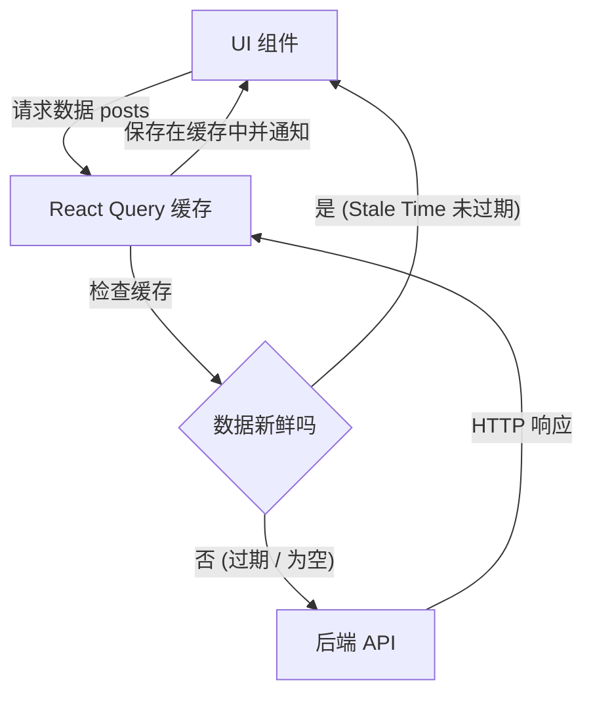

# React 专家：服务器状态、Mutations 与 React Query

如果你曾经构建过一个 `useEffect` 系统来向 API 发出请求 (fetch)，你就不得不需要手动创建三个状态：`data`，`isLoading` 和 `error`。你不得不需要处理竞争条件 (Race Conditions)，在用户快速切换页面时中止请求，并弄清楚如何缓存信息以便不轰炸你的后端。

在这个专家级别，我们接受一个基本事实：**来自后端的数据不是应用程序的状态 (Client State)，它们是服务器状态 (Server State)。**

## 1. 范式转移：TanStack Query (React Query)

Zustand 和 Redux 对于 UI 来说非常完美（如果面板打开，当前主题，内存中的购物车等）。但是对于处理 API 和数据库来说，绝对的行业标准是 **TanStack Query**。



## 2. 永远消除 useEffect

让我们看看一位专家如何在没有任何 `useEffect`、`useState` 或并发阻塞的情况下，从 API 获取数据。

```jsx
import { useQuery } from '@tanstack/react-query';
import axios from 'axios';

// 1. 我们将 fetch 的纯函数分离出来（与 React 无关）
const fetchUsuarios = async () => {
  const { data } = await axios.get('https://api.empresa.com/v1/usuarios');
  return data;
};

export const ListaUsuarios = () => {
  // 2. React Query 的魔力
  const { data: usuarios, isLoading, isError, error } = useQuery({
    queryKey: ['usuarios', 'lista'], // 这个缓存的唯一 ID
    queryFn: fetchUsuarios,
    staleTime: 1000 * 60 * 5, // 在 5 分钟内信任缓存，然后才重新获取 (refetch)
  });

  if (isLoading) return <Spinner />;
  if (isError) return <Alert msg={error.message} />;

  return (
    <ul>
      {usuarios.map(u => <li key={u.id}>{u.nombre}</li>)}
    </ul>
  );
};
```

### 全局缓存的威力
如果应用另一个视图中的其他组件发出了一个具有相同 key `['usuarios', 'lista']` 的 `useQuery`，React Query **将不会发出 HTTP 请求**。它会立即将 RAM 内存中的数据提供给它（Cache Hit），将延迟降低到 0 毫秒。

## 3. Mutations：修改服务器端

读取数据很容易；修改它并使缓存失效（以便界面刷新）才是真正的挑战。`useMutation` 负责处理更新、创建和删除。

```jsx
import { useMutation, useQueryClient } from '@tanstack/react-query';

export const FormularioCrear = () => {
  const queryClient = useQueryClient();

  const mutation = useMutation({
    mutationFn: (nuevoUsuario) => axios.post('/api/usuarios', nuevoUsuario),
    // 生命周期 hook: 当服务器响应 OK (200) 时
    onSuccess: () => {
      // 使用户列表的缓存失效。
      // 这将迫使 React Query 在后台自动进行 refetch！
      queryClient.invalidateQueries({ queryKey: ['usuarios', 'lista'] });
    },
  });

  const onSubmit = (datos) => {
    mutation.mutate(datos);
  };

  return (
    <button 
      onClick={() => onSubmit({ nombre: 'Bob' })}
      disabled={mutation.isPending} // 按钮自动控制
    >
      {mutation.isPending ? '保存中...' : '创建用户'}
    </button>
  );
};
```

使用 React Query，你的代码可以减少 50%，你的后端得益于缓存可以松一口气，而用户会觉得应用程序非常快。在**优化**级别中，我们将专注于浏览器的本地渲染瓶颈：记忆化 (Memoización)、Profiling 和大规模的代码分割 (Code Splitting)。
