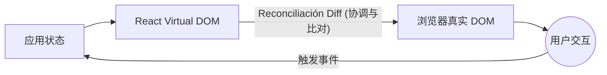

# React：初始概念与现代生命周期

欢迎来到现代 React 生态系统。使用类（Classes）和庞大生命周期（`componentDidMount`，`componentWillReceiveProps`）的日子已经一去不复返了。今天，如果使用得当，React 是函数式的、声明式的，并且速度极快。

## 1. 声明式范式

与 Vanilla JavaScript（命令式）不同，在原生 JS 中你需要告诉浏览器*如何*执行每一步（创建元素，添加类，附加到 DOM），而在 React 中，你只需告诉它你想要绘制*什么*，React 就会负责处理*如何*去做。



## 2. 函数组件（标准）

React 中的组件仅仅是一个接收数据（Props）并返回 JSX（一种介于 JS 和 HTML 之间的混合语法）的纯 JavaScript 函数。

```jsx
// 一个完美的纯组件
export const TarjetaUsuario = ({ nombre, rol }) => {
  return (
    <div className="tarjeta">
      <h2>{nombre}</h2>
      <p>角色: {rol}</p>
    </div>
  );
};
```

### 为什么使用 JSX？
JSX 并不是真正的 HTML。它是 `React.createElement()` 的语法糖。在底层，React 会将这些标签转换为 JavaScript 对象，这使得*虚拟 DOM (Virtual DOM)*能够以真实 DOM 永远无法达到的速度执行数学比较（diffing）。

## 3. 变化的引擎：Virtual DOM

当你更改应用程序的状态时，React 不会（像旧框架那样）销毁并重建整个网页。

1. **快照 (Snapshot)：** React 会拍下一张新虚拟 DOM 的“照片”。
2. **比对 (Diffing)：** 使用 O(n) 的启发式算法将新照片与旧的虚拟 DOM 进行比较。
3. **协调 (Reconciliación/Patching)：** 仅将数学上精确的变化应用到真实的 DOM 上。

如果只有按钮上的“点赞”数量发生了变化，React 会直接定位到 DOM 的该节点并更新文本，而保持树的其余部分（图片、表单）原封不动。

## 后续步骤
我们已经了解了 React 是如何在屏幕上进行绘制的。在**基础级别**中，我们将探索如何利用现代 React 的核心——Hooks（`useState` 和 `useEffect`），赋予组件“记忆”。
