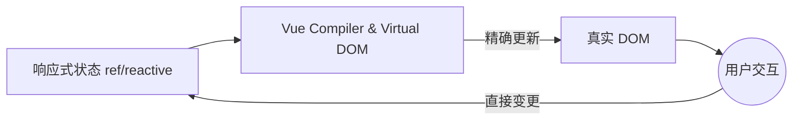

# 初始概念与响应式系统

欢迎来到 Vue.js，渐进式框架。与 React 不同，Vue 在 Vue 3 中使用基于 Proxies (代理) 的响应式系统，这使得状态管理更加直观，并且不易出现不必要的重新渲染。

## 1. 渐进式范式
Vue 被称为“渐进式”，是因为你可以用它在静态页面上仅渲染一个组件 (就像 jQuery 那样)，也可以使用 Vue Router 和 Pinia 构建一个完整的 SPA (单页应用程序)。



## 2. Options API vs Composition API
在 Vue 3 中，标准是使用带 `<script setup>` 的 **Composition API (组合式 API)**。这允许按功能而不是生命周期来对逻辑进行分组。

```html
<script setup>
import { ref } from 'vue'

const contador = ref(0)
const incrementar = () => contador.value++
</script>

<template>
  <div class="tarjeta">
    <h2>计数器: {{ contador }}</h2>
    <button @click="incrementar">增加</button>
  </div>
</template>
```
