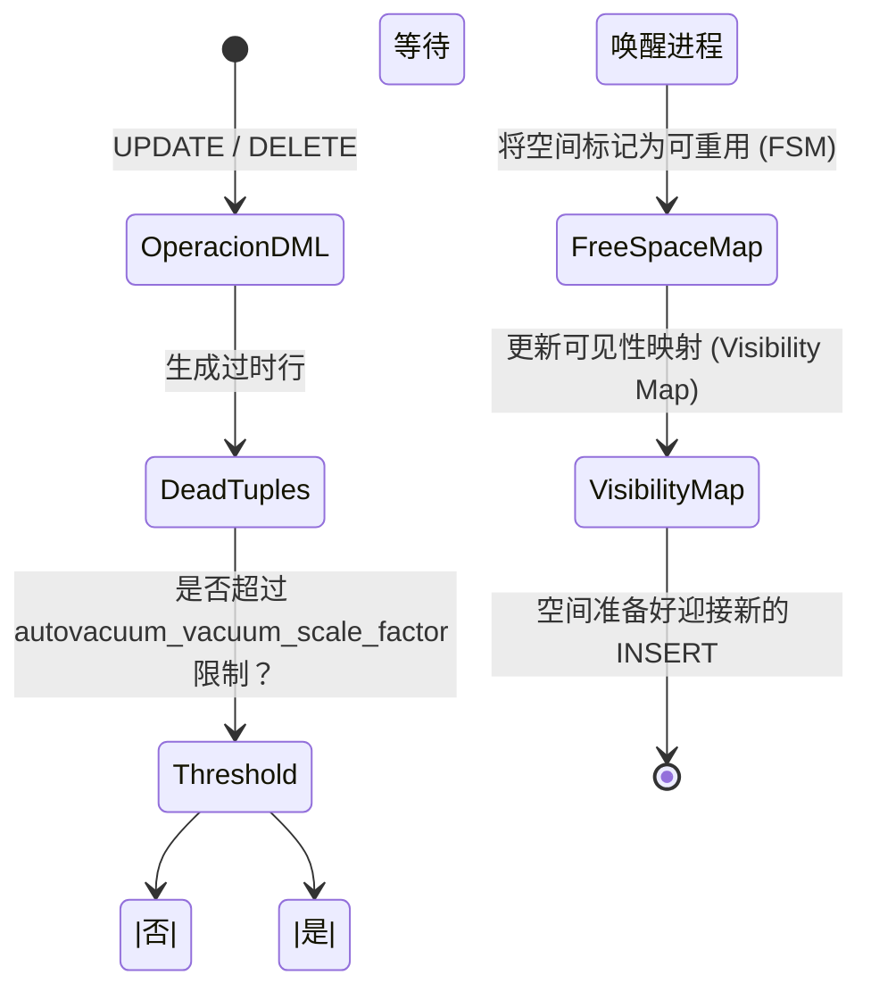

# PostgreSQL 高级：执行引擎、Vacuum 和复合索引

在高级阶段，我们不再盲目地编写代码，而是开始理解 **PostgreSQL 是如何读取我们的代码的**。查询花费 5 分钟和 50 毫秒的区别就在于对*查询规划器（Query Planner）*的理解。

## 1. EXPLAIN ANALYZE 的艺术

永远不要假设索引会被使用。PostgreSQL 拥有一个基于成本的优化器（Cost-Based Optimizer）。如果引擎计算出执行*顺序扫描（Sequential Scan）*（读取全表）比使用索引更便宜（因为你请求了 80% 的数据），它就会忽略你的索引。

### 如何阅读执行计划

```sql
EXPLAIN ANALYZE 
SELECT * FROM sales.orders 
WHERE status = 'pending' AND total > 1000;
```

**需要观察的关键指标：**
- `Execution Time`：实际花费的时间。
- `Buffers: shared hit=... read=...`：如果你看到许多 `read`，说明 Postgres 正在访问磁盘。如果你看到许多 `hit`，说明数据是由 RAM 内存提供的（非常好！）。
- `Seq Scan`：如果表有数百万行，这就是红色警报。设法将其替换为 `Index Scan` 或 `Bitmap Heap Scan`。

## 2. 复合索引和列的顺序

当你通过多列进行过滤时，简单的索引是不够的。

```sql
-- 复合索引
CREATE INDEX idx_orders_status_total ON sales.orders(status, total);
```
**黄金法则：** 顺序很重要。始终将**基数（cardinality）**最高（能最快排除最多数据的列）的列，或使用等值运算符（`=`）的列放在最前面。用于范围过滤（`>`、`<`）的列必须放在索引的最后。

## 3. Autovacuum：MVCC 的垃圾回收器

在中级阶段，我们学习了 MVCC 和 *dead tuples*（由 UPDATE 和 DELETE 生成的过时行）。如果这些行不被清理，你的数据库将会遭受 **Bloat**（膨胀），消耗磁盘空间并破坏性能。

`Autovacuum` 进程负责清理这些垃圾。

### Autovacuum 进程流程图



**针对大表的关键调优：**
Postgres 的默认值（`autovacuum_vacuum_scale_factor = 0.2`）意味着仅当 20% 的表发生更改时才会触发 Autovacuum。如果你有一张 1 亿行的表，必须有 2000 万行发生改变才能清理它！
请按表调整此值：

```sql
ALTER TABLE sales.orders SET (autovacuum_vacuum_scale_factor = 0.01);
```

理解 EXPLAIN 并掌握 Autovacuum 区分了高级开发人员和真正的数据库专家。在**专家**级别，我们将向大规模复制和分区迈进。
