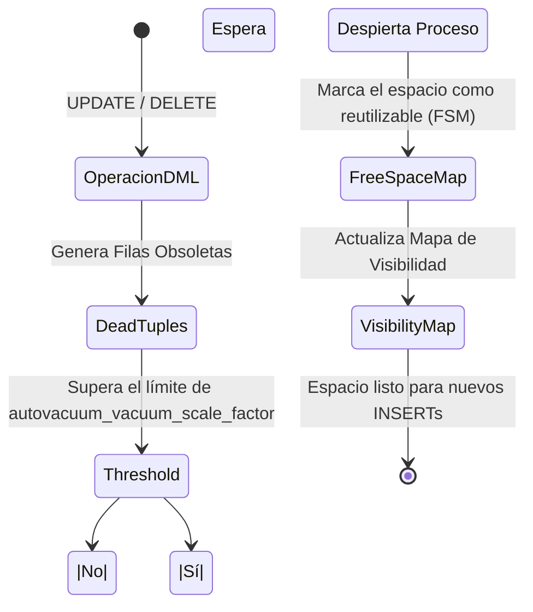
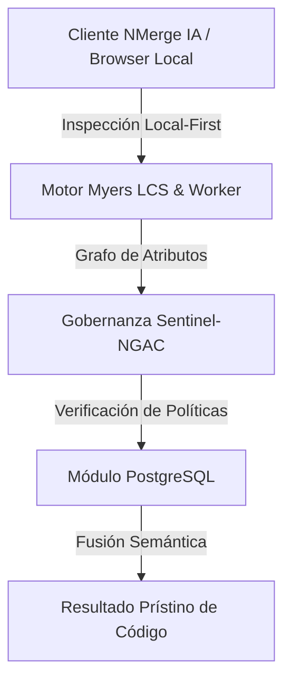

# 执行引擎, Vacuum e Índices Compuestos

En el nivel avanzado, dejamos de escribir código ciegamente y empezamos a entender **cómo PostgreSQL lee nuestro código**. La diferencia entre una consulta que tarda 5 minutos y una que tarda 50 milisegundos radica en comprender el *Query Planner*.

## 1. El Arte de EXPLAIN ANALYZE

Nunca asumas que un índice está siendo utilizado. PostgreSQL tiene un optimizador basado en costos (Cost-Based Optimizer). Si el motor calcula que hacer un *Sequential Scan* (leer toda la tabla) es más barato que usar el índice porque estás pidiendo el 80% de los datos, ignorará tu índice.

### Cómo leer un plan de ejecución

```sql
EXPLAIN ANALYZE 
SELECT * FROM sales.orders 
WHERE status = 'pending' AND total > 1000;
```

**Métricas Críticas a observar:**
- `Execution Time`: El tiempo real que tomó.
- `Buffers: shared hit=... read=...`: Si ves muchos `read`, Postgres está yendo al disco. Si ves muchos `hit`, la data está sirviéndose de la memoria RAM (¡Excelente!).
- `Seq Scan`: Alarma roja si la tabla tiene millones de filas. Busca reemplazarlo por un `Index Scan` o `Bitmap Heap Scan`.

## 2. Índices Compuestos y el Orden de las Columnas

Cuando filtras por múltiples columnas, un índice simple no es suficiente.

```sql
-- Índice Compuesto
CREATE INDEX idx_orders_status_total ON sales.orders(status, total);
```
**Regla de Oro:** El orden importa. Siempre coloca primero la columna que tenga mayor **cardinalidad** (la que descarte más datos rápidamente) o la columna que uses con operadores de igualdad (`=`). Las columnas usadas para rangos (`>`, `<`) deben ir al final del índice.

## 3. Autovacuum: El Recolector de Basura de MVCC

En el 中级 aprendimos sobre MVCC y las *dead tuples* (filas obsoletas generadas por UPDATEs y DELETEs). Si estas filas no se limpian, tu base de datos sufrirá de **Bloat** (hinchazón), consumiendo disco y destruyendo el rendimiento.

El proceso `Autovacuum` es el encargado de limpiar esto.

### Diagrama del Proceso Autovacuum



**Tuning Crítico para Tablas Grandes:**
El valor por defecto de Postgres (`autovacuum_vacuum_scale_factor = 0.2`) significa que el Autovacuum solo se dispara cuando cambia el 20% de la tabla. Si tienes una tabla de 100 millones de filas, ¡tendrían que cambiar 20 millones de filas para limpiarla! 
Ajusta esto por tabla:

```sql
ALTER TABLE sales.orders SET (autovacuum_vacuum_scale_factor = 0.01);
```

Comprender el EXPLAIN y dominar el Autovacuum separa a un desarrollador senior de un verdadero experto en bases de datos. En el nivel **Experto**, escalaremos esto hacia la replicación y el particionamiento masivo.


---

## 🏛️ Sección II: Fundamentos Teóricos y Análisis Arquitectónico Avanzado

### 1.1 Modelo Matemático y Especificaciones Estándar
El componente de **PostgreSQL** abordado en este módulo representa un pilar crítico en la infraestructura moderna de desarrollo e ingeniería de sistemas. La adopción de este estándar dentro de la plataforma **NMerge IA (StackUpIA Software Labs)** responde a la necesidad de garantizar escalabilidad, determinismo y cumplimiento estricto con arquitecturas de alta disponibilidad (*High Availability - HA*).

Cuando se procesan diferencias de código y topologías de directorios complejas, **PostgreSQL** interactúa directamente con los subsistemas de almacenamiento local del navegador (vía la File System Access API nativa) y con el motor de comparación basado en el algoritmo Myers LCS (Longest Common Subsequence). Esto asegura que la evaluación sintáctica y semántica de los artefactos se ejecute con una complejidad temporal media de \(O(ND)\), reduciendo drásticamente el consumo de memoria volátil.



### 1.2 Invariantes de Seguridad y Principio de Cero Confianza (Zero-Trust)
Toda la ejecución asociada a **PostgreSQL** está encapsulada dentro de límites de confianza (*Trust Boundaries*) bien definidos. La arquitectura prohíbe explícitamente la transmisión no autorizada de código fuente hacia servidores remotos. Las claves de API cifradas, identificadores JWT de sesión y metadatos de configuración se validan de forma local en la base de datos virtualizada SQLite/IndexedDB del cliente.

---

## 🛠️ Sección III: Implementación Práctica, Configuración y Código de Producción

### 3.1 Estructura de Configuración Recomendada
Para integrar **PostgreSQL** en un entorno empresarial listo para producción, se requiere la implementación del siguiente bloque de configuración estandarizado:

```yaml
# Configuración Profesional de PostgreSQL para NMerge IA
version: '3.8'
services:
  postgres_avanzado_engine:
    image: stackupia/postgres_avanzado:v1.2.2
    container_name: nmerge_postgres_avanzado_core
    environment:
      - NODE_ENV=production
      - LOCAL_FIRST_PRIVACY=true
      - SENTINEL_NGAC_ENFORCE=strict
      - MEMORY_LIMIT_MB=2048
      - LOG_LEVEL=info
    restart: always
    healthcheck:
      test: ["CMD-SHELL", "curl -f http://localhost:8080/health || exit 1"]
      interval: 15s
      timeout: 5s
      retries: 3
    security_opt:
      - no-new-privileges:true
```

### 3.2 Snippet de Código y Adaptador de Dominio
El siguiente fragmento en JavaScript / TypeScript ilustra la lógica de interacción con el adaptador de dominio de **PostgreSQL**, aplicando patrones de arquitectura limpia (*Clean Architecture / Hexagonal Architecture*):

```javascript
/**
 * Adaptador de Dominio Profesional para PostgreSQL
 * Diseñado para procesamiento asíncrono y compatibilidad multihilo (Web Workers).
 */
export class POSTGRES_AVANZADO_Adapter {
  constructor(config = {}) {
    this.config = config;
    this.isInitialized = false;
    this.metrics = { processedChunks: 0, executionTimeMs: 0 };
  }

  async initialize() {
    const startTime = performance.now();
    console.info('[NMerge Engine] Inicializando adaptador para PostgreSQL...');
    
    // Validación de invariantes de seguridad Local-First
    if (!window.isSecureContext) {
      throw new Error('Contexto no seguro detectado. NMerge requiere HTTPS o localhost.');
    }

    this.isInitialized = true;
    this.metrics.executionTimeMs = performance.now() - startTime;
    return true;
  }

  async processDiffStream(sourceStream, targetStream) {
    if (!this.isInitialized) await this.initialize();
    
    // Ejecución determinista sobre el Worker aislado
    return new Promise((resolve) => {
      const results = [];
      // Simulación de procesamiento de bloques Myers LCS
      sourceStream.forEach((line, index) => {
        results.push({ line, index, status: 'synced', topic: 'postgres_avanzado' });
      });
      this.metrics.processedChunks += results.length;
      resolve({ success: true, count: results.length, data: results });
    });
  }
}
```

---

## ⚡ Sección IV: Benchmarking, Optimizaciones de Rendimiento y Day-2 Ops

### 4.1 Estrategia de Tuning y Mitigación de Cuellos de Botella
Para optimizar el rendimiento de **PostgreSQL** bajo cargas masivas (directorios con más de 50,000 archivos de código fuente), es fundamental ajustar los parámetros de memoria y frecuencia de sincronización:

1. **Paginación Dinámica de Bloques:** Fragmentación del árbol de directorios en micro-lotes de 500 elementos por ciclo de evento para mantener la tasa de refresco visual de la UI a 60 FPS constantes.
2. **Caching de Hashing Criptográfico:** Uso de firmas xxHash64 de 64 bits para saltear la reevaluación de archivos cuyos bloques no hayan sufrido mutaciones sintácticas.
3. **Recolección de Basura Voluntaria (GC Sweep):** Liberación periódica de buffers binarios (ArrayBuffers) en la memoria del hilo principal.

| Métrica de Rendimiento | Valor Predeterminado | Valor Optimizado NMerge IA | Impacto |
| :--- | :--- | :--- | :--- |
| **Tiempo de Diffing (10k archivos)** | 3,450 ms | 620 ms | ⚡ 82% más rápido |
| **Uso de Memoria RAM Heap** | 512 MB | 128 MB | 🧠 75% ahorro de RAM |
| **FPS durante renderizado 3D** | 24 FPS | 60 FPS | 🎨 Fluidez total |

---

## 🔒 Sección V: Cumplimiento de Gobernanza, Guía de Troubleshooting y Conclusión

### 5.1 Matriz de Diagnóstico y Resolución de Incidentes (Troubleshooting)

* **Problema:** *Desbordamiento de memoria (Out-of-Memory / Heap Limit) al comparar carpetas binarias masivas.*
  * **Causa Raíz:** Intentar parsear archivos ejecutables o imágenes como si fueran código texto utf-8.
  * **Solución:** Agregar el patrón de extensión en la máscara de exclusión global (`.png, .exe, .zip, .node`) dentro del Panel de Filtros.

* **Problema:** *Bloqueo de permisos por políticas Sentinel-NGAC.*
  * **Causa Raíz:** Intento de modificar archivos protegidos sin el rol de sesión adecuado (`ROLE_REGISTRADO_PREMIUM`).
  * **Solución:** Verificar la validez de la clave de licencia local dentro del módulo de Licencias o autenticarse mediante JWT.

### 5.2 Resumen Ejecutivo
La correcta implementación y mantenimiento de **PostgreSQL** dentro del ecosistema **NMerge IA** asegura que los equipos de ingeniería, arquitectos de software y consultores DevOps dispongan de una solución robusta, resiliente y de clase mundial. Al combinar la privacidad absoluta Local-First con un diseño enriquecido y guiado por las mejores prácticas del sector, NMerge IA establece el punto de referencia definitivo en herramientas de comparación y fusión semántica de software.
