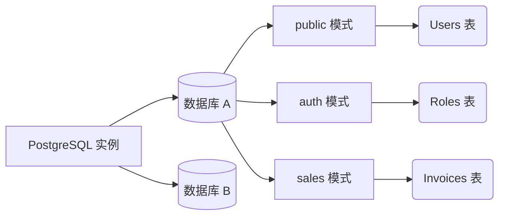

# PostgreSQL 基础：基础知识、数据类型和核心查询

我们已经通过了基础设施阶段。现在我们将进入开发者的“游乐场”。PostgreSQL 不仅仅是一个行列的存储库；它是一个对象关系型数据库管理系统（ORDBMS）。这意味着它支持继承、复杂数据类型和扩展。

## 1. 模式（Schemas）范式

从 MySQL 迁移过来的开发者常犯的一个错误是将数据库用作表的第一层且唯一的逻辑容器。在 PostgreSQL 中，我们有一个中间层：**模式（Schema）**。



默认情况下，所有的表都在 `public` 模式中创建。**最佳实践：** 如果你正在构建一个单体架构或使用单个数据库的微服务架构，请使用模式来划分你的业务领域。

```sql
CREATE SCHEMA IF NOT EXISTS billing;
CREATE SCHEMA IF NOT EXISTS inventory;
```

## 2. 数据类型：JSONB 和数组的威力

PostgreSQL 打破了“SQL 数据库很死板”的神话。Postgres 原生支持 NoSQL 数据类型，并具有出色的性能。

### JSONB（二进制 JSON）类型
虽然 `JSON` 存储纯文本，但 `JSONB` 会将 JSON 预处理为自定义的二进制格式。这使得插入速度稍慢，但读取和**索引搜索**速度惊人地快。

```sql
CREATE TABLE billing.invoices (
    id UUID PRIMARY KEY DEFAULT gen_random_uuid(),
    customer_name VARCHAR(150) NOT NULL,
    total_amount NUMERIC(10, 2),
    metadata JSONB,
    created_at TIMESTAMP WITH TIME ZONE DEFAULT NOW()
);

-- 在关系型表中插入 NoSQL 数据
INSERT INTO billing.invoices (customer_name, total_amount, metadata)
VALUES ('Acme Corp', 500.50, '{"tags": ["b2b", "premium"], "payment_gateway": "stripe", "tax_exempt": false}');
```

### 查询 JSONB 内部数据
PostgreSQL 提供了特殊的运算符（如 `->>` 和 `@>`）来在文档内部进行搜索：

```sql
-- 查找所有由 Stripe 处理的发票
SELECT customer_name, total_amount 
FROM billing.invoices 
WHERE metadata @> '{"payment_gateway": "stripe"}';

-- 提取列表中的第一个标签
SELECT metadata->'tags'->>0 AS primary_tag 
FROM billing.invoices;
```

## 3. 严格的参照完整性（约束 Constraints）

一个设计良好的模式不会依赖前端或后端代码来过滤错误；数据库是**最后一道防线**。

```sql
CREATE TABLE inventory.products (
    id SERIAL PRIMARY KEY,
    sku VARCHAR(20) UNIQUE NOT NULL,
    price NUMERIC(8,2) CHECK (price > 0),
    discount_percentage INT DEFAULT 0 CHECK (discount_percentage BETWEEN 0 AND 100),
    status VARCHAR(20) DEFAULT 'draft' CHECK (status IN ('draft', 'active', 'archived'))
);
```
不遗余力地使用 `CHECK` 约束可确保*永远*不会录入价格为负的产品，无论你的 Node.js 或 Python API 中有多少个 bug。

## 4. B-Tree 索引简介

B-Tree（平衡树）索引是 Postgres 的主力。它是默认的索引，并且针对等值和范围运算符（`<`、`<=`、`=`、`>=`、`>`）进行了优化。

```sql
-- 创建一个经典的 B-Tree 索引以加速搜索
CREATE INDEX idx_products_sku ON inventory.products(sku);

-- 部分索引：仅索引满足条件的行。
-- 节省大量的磁盘空间和 RAM 内存。
CREATE INDEX idx_active_products ON inventory.products(status) WHERE status = 'active';
```

### 什么时候使用部分索引？
如果你有一个包含 1000 万条记录的“Users”表，但只有 50,000 条被标记为 `is_deleted = false`，那么与索引整个表相比，对活跃用户创建部分索引将非常微小且超快。

## 结语
掌握 `JSONB` 类型，使用逻辑模式，并使用 `CHECK` 约束保护你的信息，将使你的数据库从美化的电子表格转变为强大的数据金库。在**中级**中，我们将探索复杂查询的黑魔法：*通用表表达式（CTEs）* 和 *窗口函数（Window Functions）*。
