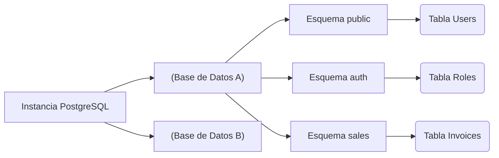

# Fundamentos, Tipos de Datos y Consultas Core

Ya superamos la fase de infraestructura. Ahora entraremos al "terreno de juego" del desarrollador. PostgreSQL no es solo un almacén de filas y columnas; es un sistema de bases de datos Objeto-Relacional (ORDBMS). Esto significa que soporta herencia, tipos de datos complejos y extensiones.

## 1. El Paradigma de los Esquemas (Schemas)

Un error muy común entre desarrolladores que migran desde MySQL es usar la base de datos como el único contenedor lógico de tablas. En PostgreSQL, tenemos una capa intermedia: el **Esquema (Schema)**.



Por defecto, todas las tablas se crean en el esquema `public`. **Buena Práctica:** Si estás construyendo una arquitectura monolítica o de microservicios con una sola BD, divide tus dominios de negocio usando esquemas.

```sql
CREATE SCHEMA IF NOT EXISTS billing;
CREATE SCHEMA IF NOT EXISTS inventory;
```

## 2. Tipos de Datos: El Poder de JSONB y Arrays

PostgreSQL destruye el mito de que "las bases de datos SQL son rígidas". Postgres soporta nativamente tipos de datos NoSQL con un rendimiento excepcional.

### El tipo JSONB (JSON Binario)
Mientras que `JSON` guarda texto plano, `JSONB` pre-procesa el JSON en un formato binario personalizado. Esto hace que la inserción sea un poco más lenta, pero las lecturas y **búsquedas indexadas** sean asombrosamente rápidas.

```sql
CREATE TABLE billing.invoices (
    id UUID PRIMARY KEY DEFAULT gen_random_uuid(),
    customer_name VARCHAR(150) NOT NULL,
    total_amount NUMERIC(10, 2),
    metadata JSONB,
    created_at TIMESTAMP WITH TIME ZONE DEFAULT NOW()
);

-- Inserción de datos NoSQL dentro de una tabla relacional
INSERT INTO billing.invoices (customer_name, total_amount, metadata)
VALUES ('Acme Corp', 500.50, '{"tags": ["b2b", "premium"], "payment_gateway": "stripe", "tax_exempt": false}');
```

### Consultando el interior del JSONB
PostgreSQL proporciona operadores especiales (como `->>` y `@>`) para buscar dentro del documento:

```sql
-- Buscar todas las facturas procesadas por Stripe
SELECT customer_name, total_amount 
FROM billing.invoices 
WHERE metadata @> '{"payment_gateway": "stripe"}';

-- Extraer el primer tag de la lista
SELECT metadata->'tags'->>0 AS primary_tag 
FROM billing.invoices;
```

## 3. Integridad Referencial Estricta (Constraints)

Un esquema bien diseñado no confía en que el código del Frontend o del Backend filtre los errores; la base de datos es la **última línea de defensa**.

```sql
CREATE TABLE inventory.products (
    id SERIAL PRIMARY KEY,
    sku VARCHAR(20) UNIQUE NOT NULL,
    price NUMERIC(8,2) CHECK (price > 0),
    discount_percentage INT DEFAULT 0 CHECK (discount_percentage BETWEEN 0 AND 100),
    status VARCHAR(20) DEFAULT 'draft' CHECK (status IN ('draft', 'active', 'archived'))
);
```
El uso indiscriminado de `CHECK` constraints asegura que *nunca* entrará un producto con precio negativo, sin importar cuántos bugs tenga tu API en Node.js o Python.

## 4. Introducción a los Índices B-Tree

El Índice B-Tree (Árbol Balanceado) es el caballo de batalla de Postgres. Es el índice por defecto y está optimizado para operadores de igualdad y rangos (`<`, `<=`, `=`, `>=`, `>`).

```sql
-- Creando un índice B-Tree clásico para acelerar búsquedas
CREATE INDEX idx_products_sku ON inventory.products(sku);

-- Índice parcial: Solo indexa las filas que cumplen la condición.
-- Ahorra muchísimo espacio en disco y memoria RAM.
CREATE INDEX idx_active_products ON inventory.products(status) WHERE status = 'active';
```

### ¿Cuándo usar índices parciales?
Si tienes una tabla de "Usuarios" con 10 millones de registros, pero solo 50,000 están marcados como `is_deleted = false`, un índice parcial sobre los usuarios activos será microscópico y ultra-rápido en comparación a indexar la tabla entera.

## Reflexión de Cierre
Dominar los tipos `JSONB`, usar esquemas lógicos y proteger tu información con `CHECK` constraints transformará tus bases de datos de simples hojas de cálculo glorificadas en bóvedas de datos robustas. En el **中级**, exploraremos el arte negro de las consultas complejas: *Common Table Expressions (CTEs)* y *Window Functions*.
