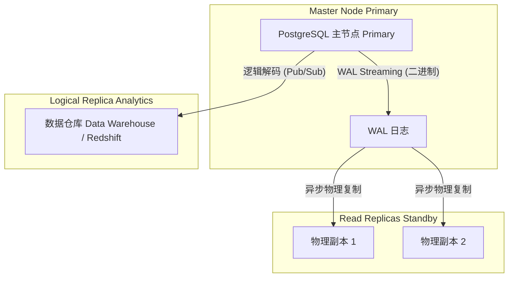

# PostgreSQL 专家：复制与大规模分区

当单个 PostgreSQL 实例无法处理读取负载或存储量（我们说的是 TB 级数据）时，我们就进入了专家领域。现在是分配负载的时候了。

## 1. 声明式分区（本地分片 Sharding Local）

如果你有一个包含 5 亿条记录的 `logs` 表，尝试使用 `DELETE` 删除旧数据将会锁定表并导致性能崩溃。解决方案是在物理上分割表，同时保持单个逻辑表。

### 示例：按时间（范围）分区

```sql
-- 1. 创建“父”表
CREATE TABLE telemetry.sensor_logs (
    id UUID,
    sensor_id INT,
    reading NUMERIC,
    created_at TIMESTAMP NOT NULL
) PARTITION BY RANGE (created_at);

-- 2. 创建“子”表（物理表）
CREATE TABLE sensor_logs_y2023m10 PARTITION OF telemetry.sensor_logs
    FOR VALUES FROM ('2023-10-01') TO ('2023-11-01');

CREATE TABLE sensor_logs_y2023m11 PARTITION OF telemetry.sensor_logs
    FOR VALUES FROM ('2023-11-01') TO ('2023-12-01');
```

**关键优势：** 当 10 月份不再有用时，你不要执行 `DELETE`。只需执行 `DROP TABLE sensor_logs_y2023m10;`。此操作可立即释放 GB 级的空间，而不会影响服务器性能。

## 2. 复制拓扑结构：流式复制 vs 逻辑复制

要扩展读取或保证高可用性（HA），你需要副本（replicas）。



### 物理复制（Streaming Replication）
通过读取预写式日志（WAL）逐块复制整个数据库。物理副本是**只读**的。它是故障转移（failover）的理想选择（如果主节点宕机，副本接管）。

### 逻辑复制（Pub/Sub）
Postgres 不是复制原始的二进制块，而是将 WAL 解码为应用层事件（`INSERT`、`UPDATE`、`DELETE`），并将它们发送给订阅者。
- 允许**仅复制特定的表**（非常适合将销售表发送到数据湖）。
- 允许目标节点向其自己独立的表写入数据。

```sql
-- 在 Master 服务器上：
CREATE PUBLICATION sales_pub FOR TABLE sales.orders, sales.invoices;

-- 在分析服务器上：
CREATE SUBSCRIPTION sales_sub CONNECTION 'host=master_ip port=5432 user=rep_user password=secret' PUBLICATION sales_pub;
```

掌握分区和复制功能可让你将 Postgres 扩展至近乎无限。在**大师级别（优化）**，我们将探索内核调优和连接池，以将硬件性能发挥到极致。

