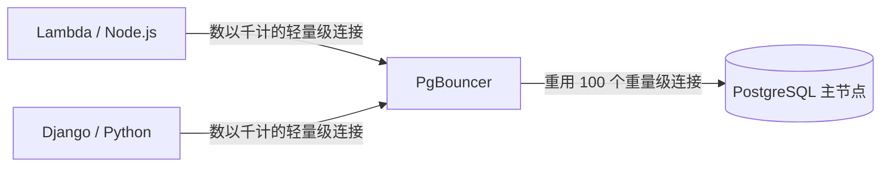

# PostgreSQL 大师：极限调优、PgBouncer 和优化

欢迎来到最终级别。在这里，我们不写 SQL；我们修改 Linux 内核的行为，并操作原始内存分配，以从支持我们数据库的钢铁（硬件）中压榨出每一分性能。

## 1. 连接问题（连接池 Connection Pooling）

正如我们在初始级别中看到的，Postgres 会为每个客户端连接执行一个 *fork*（创建一个新进程）。每个进程大约消耗 2 到 10 MB 的 RAM。如果你的 Serverless API（例如 AWS Lambda）打开 5,000 个并发连接，Postgres 将在空闲进程中消耗掉服务器的所有内存，导致*内存不足（Out of Memory, OOM）崩溃*。

### 采用 PgBouncer 的架构

生产环境中强制性的解决方案是在数据库前面放置一个**连接池（Connection Pooler）**。`PgBouncer` 是行业标准。



PgBouncer 维护着一小部分与 Postgres 的活跃连接。当 API 请求执行查询时，PgBouncer 会借给它一个连接，执行查询，然后立即将其返回给连接池（*事务池 Transaction Pooling*）。这在管理连接方面将 Postgres 的 CPU 负载降低到几乎为零。

## 2. 极限调优：修改 postgresql.conf

默认的 `postgresql.conf` 文件是为了在 Raspberry Pi 上运行而配置的（也就是说，它使用最少的资源）。如果你在具有 64GB RAM 和 NVMe 磁盘的服务器上运行，你就是在浪费 95% 的硬件。

### 关键的优化参数（以 64GB RAM 服务器为例）：

```conf
# 1. 共享内存（表缓存存储）
# 建议：总 RAM 的 25% 到 40%。
shared_buffers = 16GB 

# 2. 排序内存（Sorts, Hashes）
# 每个连接的内存。注意：如果有 100 个连接在做巨大的排序，它将消耗 100 * 64MB。
work_mem = 64MB 
maintenance_work_mem = 2GB # 仅用于 VACUUM 和索引（INDEX）创建。

# 3. SSD 磁盘调优（避免 HDD 机械硬盘行为）
random_page_cost = 1.1 # 假设随机读取几乎与顺序读取一样快。
effective_io_concurrency = 200 # 增加 SSD 的异步 I/O 处理。

# 4. 事务和 WAL
wal_level = logical # 如果需要，为逻辑复制做好准备
checkpoint_completion_target = 0.9 # 在检查点（checkpoints）期间平滑磁盘写入
```

## 3. Linux 中的大页（Huge Pages）（操作系统调优）

对于高性能数据库而言，操作系统在管理标准的 4KB“内存页”上消耗了太多 CPU。启用 **大页（Huge Pages）**（2MB 或 1GB 的页面）允许 Postgres 仅用很小的 CPU 工作量来管理其 `shared_buffers`。

1. 计算 `shared_buffers` 的大小。
2. 在 Linux 中配置 `/etc/sysctl.conf`：
   ```bash
   vm.nr_hugepages = 8500
   ```
3. 告诉 Postgres 在 `postgresql.conf` 中使用它们：
   ```conf
   huge_pages = on
   ```

你已经达到了大师级别。从基础语法到内核配置，你的 PostgreSQL 基础设施现在已经准备好在全球范围内运行，能够容忍灾难性的故障，并每秒处理数以百万计的事务。
