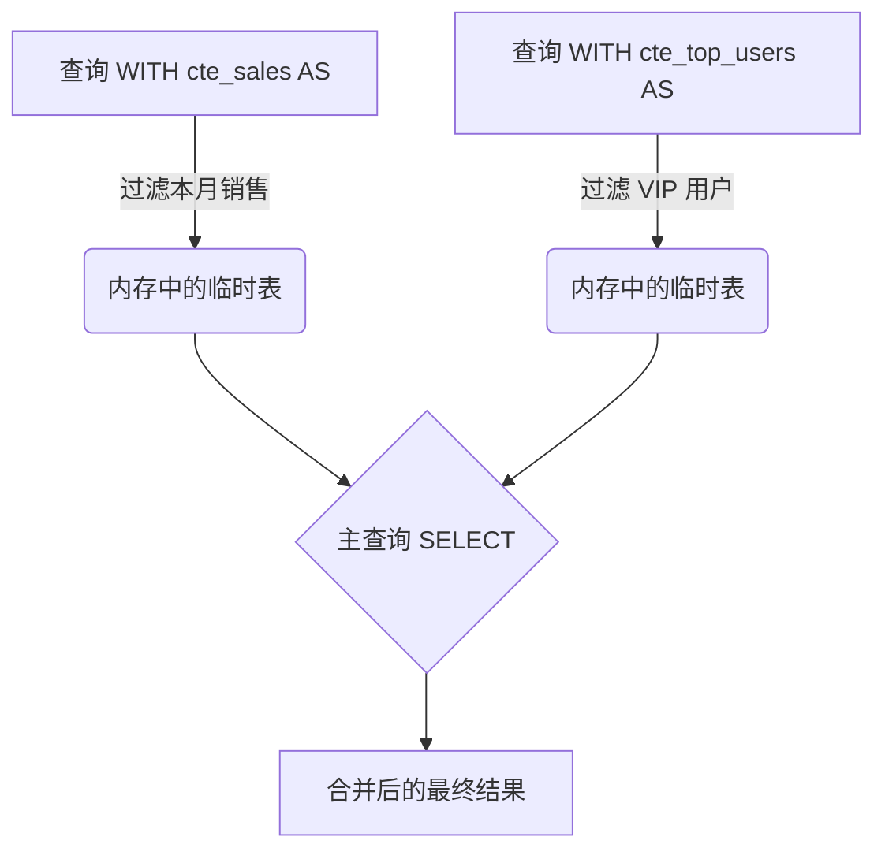
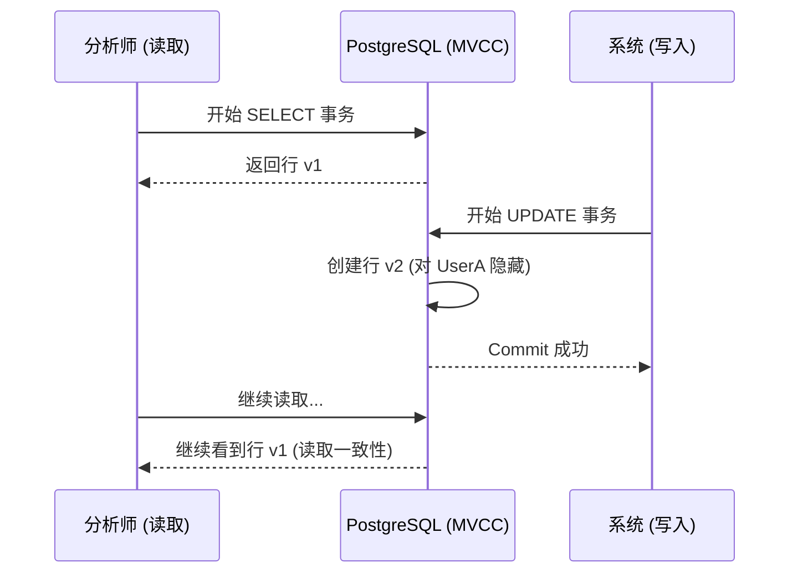

# PostgreSQL 中级：高级查询、CTEs 和 ACID 事务

当基本的 `SELECT` 和 `JOIN` 不足以处理业务逻辑时，我们就进入了中级。在这里，我们将 PostgreSQL 从一个简单的数据存储库转变为一个**分析计算引擎**。将计算转移到数据库（数据所在的地方）几乎总是比通过网络将千兆字节的数据发送到你的 Node.js 或 Python 服务器更高效。

## 1. 通用表表达式（CTEs）：清理意大利面条式的 SQL

嵌套子查询很快就会变成维护的地狱。CTEs（`WITH` 子句）允许你定义临时且可读的结果块。

### CTE 流程图



### 实际示例
假设我们想计算“顶级客户”的平均客单价，而不用写成一团乱麻的 SQL：

```sql
WITH top_customers AS (
    SELECT customer_id, SUM(total_amount) as lifetime_value
    FROM billing.invoices
    GROUP BY customer_id
    HAVING SUM(total_amount) > 10000
),
recent_invoices AS (
    SELECT customer_id, total_amount
    FROM billing.invoices
    WHERE created_at >= NOW() - INTERVAL '30 days'
)
-- 连接 CTEs 的主查询
SELECT t.customer_id, t.lifetime_value, AVG(r.total_amount) as avg_recent_ticket
FROM top_customers t
JOIN recent_invoices r ON t.customer_id = r.customer_id
GROUP BY t.customer_id, t.lifetime_value;
```

## 2. 窗口函数（Window Functions）：分析的魔法

*窗口函数* 允许在与当前行相关的一组行上执行计算，**而无需对它们进行分组（不像 `GROUP BY` 那样折叠结果）**。

你想知道一个员工的薪水在他们自己的部门内的排名，同时保留该员工的详细信息吗？

```sql
SELECT 
    employee_name, 
    department, 
    salary,
    RANK() OVER (PARTITION BY department ORDER BY salary DESC) as salary_rank,
    salary - AVG(salary) OVER (PARTITION BY department) as diff_from_dept_avg
FROM hr.employees;
```
在这段神奇的代码中：
- `PARTITION BY` 按部门创建子组（窗口）。
- 查询返回员工的**所有**行，但添加了通过观察整个窗口进行分析计算的列。

## 3. 事务和并发控制（MVCC）

得益于其 MVCC（*多版本并发控制*）架构，PostgreSQL 遵循 **ACID**（原子性、一致性、隔离性、持久性）。

### 什么是 MVCC？
当你在 Postgres 中更新一行时，引擎**不会**覆盖磁盘上的数据。相反，它将旧行标记为“过时”（死元组），并插入该行的新版本。这意味着**读取者永远不会阻塞写入者，写入者也永远不会阻塞读取者。**



### 显式事务
对关键操作进行分组可确保数据库状态的一致性。

```sql
BEGIN; -- 开始事务

UPDATE accounts SET balance = balance - 100 WHERE id = 1;
UPDATE accounts SET balance = balance + 100 WHERE id = 2;

-- 如果这里你的代码出现错误，执行 ROLLBACK;
-- 如果一切正常，提交：
COMMIT; 
```

## 4. Upsert (INSERT ... ON CONFLICT)

*Upsert* 模式解决了尝试插入可能已存在的记录时的并发竞争问题。与其从后端进行 `SELECT`（为了验证）然后 `INSERT` 或 `UPDATE`（这很慢且容易出现竞争条件），不如原子地执行它：

```sql
INSERT INTO analytics.daily_stats (date, user_id, visits)
VALUES ('2023-10-01', 105, 1)
ON CONFLICT (date, user_id) 
DO UPDATE SET visits = analytics.daily_stats.visits + 1;
```

有了这些工具，你已经告别了编写单一的 SQL。你现在正在编写干净、声明式和数学上严谨的代码。在**高级**中，我们将深入研究引擎的底层：执行计划（EXPLAIN）和内部清理（Vacuum）。
