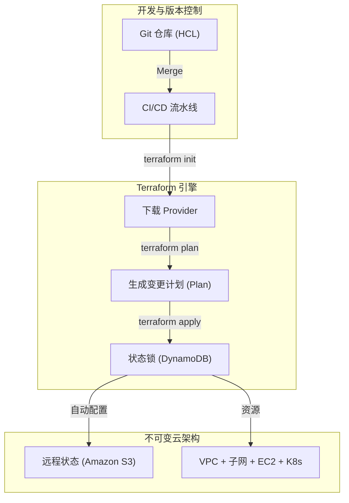

# 基础设施即代码与不可变性 (IaC & Terraform)

**基础设施即代码 (IaC)** 是通过声明性代码自动化配置和管理云基础架构的核心 DevOps 实践。

## 1. 声明式架构



## 2. Terraform 生命周期

```bash
terraform init
terraform plan
terraform apply -auto-approve
terraform destroy
```

## 3. 远程状态与并发锁 (S3 + DynamoDB)

```hcl
terraform {
  backend "s3" {
    bucket         = "nmerge-terraform-state-prod"
    key            = "global/s3/terraform.tfstate"
    region         = "us-east-1"
    dynamodb_table = "nmerge-terraform-locks"
    encrypt        = true
  }
}
```
