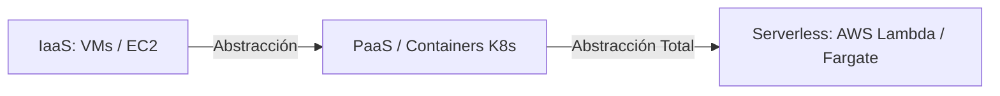
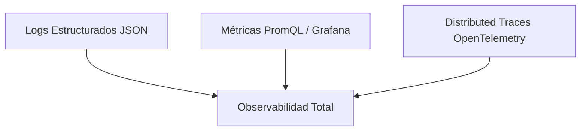

# 云原生、无服务器和站点可靠性工程 (SRE)

**云原生**开发和**站点可靠性工程 (SRE)** 实践代表了设计、部署和操作大规模容错分布式应用程序的现代方法。

---

## 1. 云原生原则（12 要素应用程序标准）

云原生应用程序遵循 12 个因素方法来确保云环境中的可移植性、不变性和可扩展性：

1. **代码库：** 每个微服务一个存储库，多个部署（Dev、Staging、Prod）。
2. **依赖关系：** 显式声明和隔离（`package.json`、`Dockerfile`）。
3. **配置：**严格存储在**环境变量**（`process.env`）中，绝不存储在源代码中。
4. **支持服务：** 将备份资源（数据库、Redis、RabbitMQ）视为可通过 URL/凭据访问的附加资源。
5. **Build、Release、Run：** Build（镜像编译）、Release（与配置联合）和Run（容器执行）阶段严格分离。
6. **无状态进程：** 应用程序必须运行无状态进程。任何持久状态都应该委托给外部服务（PostgreSQL、Redis）。
7. **端口绑定：** 使用透明HTTP/TCP端口映射导出服务。
8. **并发性：** 使用进程模型（克隆 Pod/实例）水平扩展。
9. **丢弃

> [!NOTE]
> 白皮书的其余部分保留其原始语言，以保留代码和图表的语法。

abilidad:** Inicio rápido y apagado gradual (*Graceful Shutdown* reaccionando a señales `SIGTERM`).
10. **Paridad entre Dev y Prod:** Mantener entornos de desarrollo y producción lo más idénticos posible.
11. **Logs como Streams:** Tratar logs como flujos continuos de eventos hacia `stdout` / `stderr`.
12. **Procesos de Administración:** Ejecutar tareas administrativas/migraciones como procesos únicos de una sola vez.

---

## 2. Serverless vs Containers (CaaS)



* **Serverless (FaaS):** Modelo basado en eventos de ejecución efímera. Auto-escala de $0$ a miles de instancias bajo demanda y cobra únicamente por los milisegundos reales de cómputo consumidos.
* **Graceful Shutdown Pattern en Node.js (Cloud Native):**
```javascript
const server = app.listen(3005, () => console.log('Server running on 3005'));

process.on('SIGTERM', () => {
  console.log('SIGTERM recibido. Cerrando conexiones HTTP de forma gradual...');
  server.close(() => {
    console.log('Servidor HTTP cerrado. Desconectando Base de Datos...');
    db.destroy().then(() => process.exit(0));
  });
});
```

---

## 3. Arquitectura SRE: SLI, SLO y Presupuesto de Error (Error Budget)

SRE es la disciplina que aplica principios de ingeniería de software a las operaciones de infraestructura.

### A. Definición de Métricas Core SRE:
* **SLI (Service Level Indicator):** La medida cuantitativa real del rendimiento del servicio.
  $$\text{SLI} = \frac{\text{Número de Peticiones Exitosas } (< 200\text{ms})}{\text{Número Total de Peticiones}} \times 100\%$$
* **SLO (Service Level Objective):** El objetivo meta acordado internamente (ej. $99.9\%$ de peticiones exitosas al mes).
* **Error Budget:** La cuota de error permitida ($100\% - \text{SLO}$). Para un SLO del $99.9\%$, el presupuesto de error es $0.1\%$.

```gherkin
FEATURE: Gobierno de Despliegues por Error Budget
  GIVEN un SLO mensual de disponibilidad del 99.9%
  AND un Error Budget consumido del 100% debido a incidentes Sev-1
  WHEN un equipo de desarrollo intenta desplegar una nueva feature a Producción
  THEN el pipeline de CI/CD debe congelar el despliegue de características
  AND permitir únicamente hotfixes de estabilidad y mejoras SRE
```

---

## 4. Observabilidad: Los Tres Pilares (Logs, Metrics, Traces)



1. **Logs (Registros):** Eventos discretos codificados en JSON estructurado para indexación en ELK o Loki.
2. **Metrics (Métricas):** Datos agregados en series temporales (CPU, Latencia p99, Error Rate) visualizados en Grafana.
3. **Traces (Trazas Distribuidas):** Seguimiento del ciclo de vida de una petición HTTP a través de múltiples microservicios utilizando cabeceras `W3C Trace Context` (`traceparent`).
